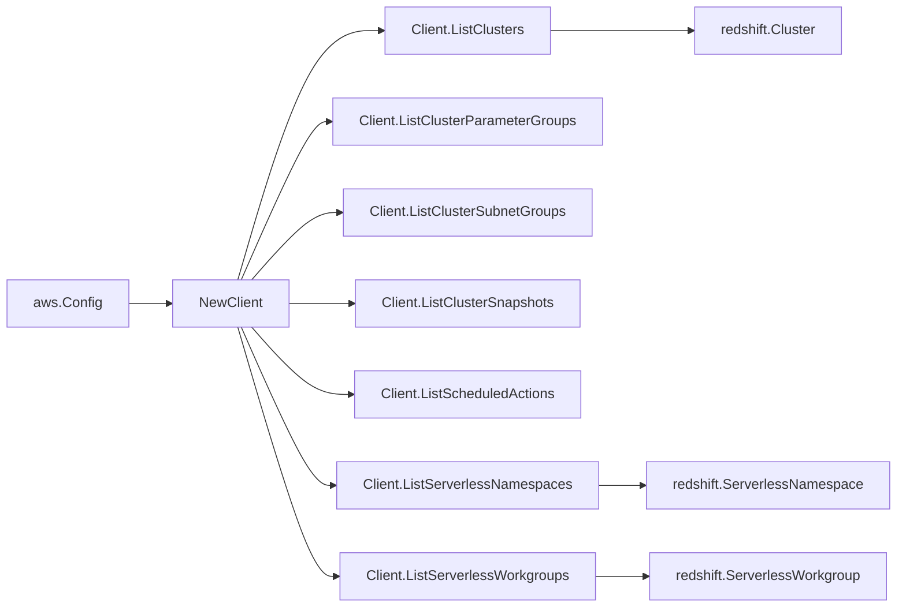

# AWS Redshift SDK Adapter

## Purpose

`internal/collector/awscloud/services/redshift/awssdk` adapts AWS SDK for Go v2
Redshift and Redshift Serverless responses to the scanner-owned `Client`
contract. It owns pagination for both control planes, resource tag reads for
Serverless ARN-addressable resources, throttle classification, and per-call
AWS API telemetry.

## Ownership boundary

This package owns SDK calls for Redshift. It does not own workflow claims,
credential acquisition, Redshift fact selection, graph writes, reducer
admission, workload ownership, or query behavior.

## Exported surface

See `doc.go` for the godoc contract.

- `Client` - AWS SDK-backed implementation of `redshift.Client` covering both
  provisioned Redshift and Redshift Serverless.
- `NewClient` - builds a `Client` for one claimed AWS boundary.

## Dependencies

- `internal/collector/awscloud` for account, region, and service boundary
  labels.
- `internal/collector/awscloud/services/redshift` for scanner-owned result
  types.
- `internal/telemetry` for AWS API call and throttle instruments.
- AWS SDK for Go v2 `redshift` and `redshiftserverless` packages and the
  Smithy error contract.

## Telemetry

Redshift and Redshift Serverless list pages and tag reads are wrapped with:

- `aws.service.pagination.page`
- `eshu_dp_aws_api_calls_total`
- `eshu_dp_aws_throttle_total`

Metric labels stay bounded to service, account, region, operation, and result.
Provisioned and Serverless API calls share the `service="redshift"` label and
are distinguished through the `operation` attribute. ARNs, endpoints, tags,
KMS key IDs, parameter group names, namespace names, workgroup names, and raw
AWS error payloads stay out of metric labels.

## Gotchas / invariants

- The adapter calls only `DescribeClusters`, `DescribeClusterParameterGroups`,
  `DescribeClusterSubnetGroups`, `DescribeClusterSnapshots`,
  `DescribeScheduledActions`, `ListNamespaces`, `ListWorkgroups`, and
  `ListTagsForResource` (Serverless). It does not call provisioned Redshift
  `ListTagsForResource` because provisioned describe calls already return
  tags inline on the resource shapes the adapter maps.
- Describe calls set `MaxRecords=100`, the documented maximum, and follow
  Redshift `Marker` pagination. Serverless list calls follow `NextToken`
  pagination.
- The adapter maps safe control-plane fields and drops master user names,
  admin user names, master password secret ARNs and KMS key IDs, query
  results, snapshot payloads, table data, and target-action JSON payloads
  during mapping. Scheduled action target identity is reduced to
  `target_action_name` and `target_cluster_identifier`.
- The adapter must not call `CreateCluster`, `ModifyCluster`,
  `DeleteCluster`, `RebootCluster`, `CreateClusterSnapshot`,
  `DeleteClusterSnapshot`, `ModifyClusterIamRoles`, or any Redshift or
  Redshift Serverless mutation API.
- Provisioned cluster ARNs are synthesized from the boundary and reported
  cluster identifier. The adapter must not impersonate
  `ClusterNamespaceArn` (which addresses the namespace, not the cluster) as
  the cluster ARN.

## Related docs

- `docs/public/services/collector-aws-cloud.md`
- `docs/public/services/collector-aws-cloud-scanners.md`
- `docs/public/guides/collector-authoring.md`
