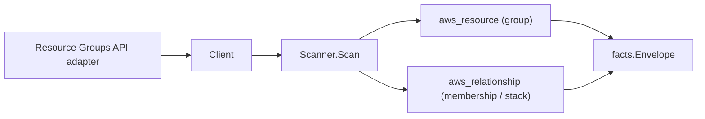

# AWS Resource Groups Scanner

## Purpose

`internal/collector/awscloud/services/resourcegroups` owns the AWS Resource
Groups scanner contract for the AWS cloud collector. It converts each resource
group into an `aws_resource` fact (name, ARN, description, query type) and emits
the membership edges that connect a group to its member resources, plus a
group-to-CloudFormation-stack edge for stack-backed groups.

The product value is the membership graph: a Resource Groups group can span
arbitrary resource families, so the scanner classifies every member ARN into its
resource family and keys the edge by the exact identity that family's own scanner
publishes. Members whose family the scanner cannot recognize are skipped, never
emitted with an empty or guessed target type.

## Ownership boundary

This package owns scanner-level Resource Groups fact selection, the ARN-to-family
membership classifier, and identity mapping. It does not own AWS SDK pagination,
STS credentials, fact persistence, graph writes, reducer admission, or query
behavior.

## Exported surface

See `doc.go` for the godoc contract.

- `Client` - minimal Resource Groups metadata read surface consumed by
  `Scanner` (one `ListGroups` method that returns groups already enriched with
  their query type and members).
- `Scanner` - emits the group resource plus membership and stack-backing
  relationships for one boundary.
- `Group`, `ResourceMember` - scanner-owned views with the resource-query body
  intentionally omitted.

## Membership classifier

`helpers.go` holds the `classifyMember` classifier. It parses each member ARN
into its colon-separated fields (never substring-matches the raw ARN) and maps
the `service` plus the leading resource-type token to a declared
`awscloud.ResourceType*` and the published identity of the target scanner:

| Member family | `target_type` | `target_resource_id` | Keyed by |
| --- | --- | --- | --- |
| S3 bucket | `aws_s3_bucket` | member ARN | ARN |
| Lambda function | `aws_lambda_function` | member ARN | ARN |
| DynamoDB table | `aws_dynamodb_table` | member ARN | ARN |
| SQS queue | `aws_sqs_queue` | member ARN | ARN |
| SNS topic | `aws_sns_topic` | member ARN | ARN |
| Kinesis stream | `aws_kinesis_data_stream` | member ARN | ARN |
| RDS instance / cluster | `aws_rds_db_instance` / `aws_rds_db_cluster` | member ARN | ARN |
| ECS cluster / service / task | `aws_ecs_cluster` / `aws_ecs_service` / `aws_ecs_task` | member ARN | ARN |
| EKS cluster | `aws_eks_cluster` | member ARN | ARN |
| ELBv2 load balancer | `aws_elbv2_load_balancer` | member ARN | ARN |
| Secrets Manager secret | `aws_secretsmanager_secret` | member ARN | ARN |
| CloudFormation stack | `aws_cloudformation_stack` | member ARN (StackId) | ARN |
| KMS key | `aws_kms_key` | bare key id | bare id |
| Route 53 hosted zone | `aws_route53_hosted_zone` | `/hostedzone/<id>` | prefixed id |
| EC2 instance | `aws_ec2_instance` | `i-<id>` | bare id |
| EC2 VPC / subnet / security-group / network-interface / launch-template | `aws_ec2_vpc` / `aws_ec2_subnet` / `aws_ec2_security_group` / `aws_ec2_network_interface` / `aws_ec2_launch_template` | bare id | bare id |
| EC2 Elastic IP | `aws_vpc_elastic_ip` | `eipalloc-<id>` | bare id |

Every other family is skipped. ARN-keyed targets set `target_arn` to the member
ARN; bare-id and prefixed-id targets leave `target_arn` empty so the edge is not
falsely marked ARN-keyed, matching the `relguard` runtime contract.

## Dependencies

- `internal/collector/awscloud` for boundaries, resource constants, relationship
  constants, and envelope builders.
- `internal/facts` for emitted fact envelope kinds.

The package depends on a small `Client` interface rather than the AWS SDK for Go
v2 so tests can use fake clients and runtime adapters can own SDK behavior.

## Telemetry

This scanner emits no spans or logs directly. `awsruntime.ClaimedSource` records
scan duration and emitted resource counts after `Scanner.Scan` returns. The
`awssdk` adapter records Resource Groups API call counts, throttles, and
pagination spans.

## Gotchas / invariants

- Resource Groups facts are metadata only. The scanner never reads or persists
  the resource-query body (tag-filter expression or CloudFormation template
  JSON); it records the query type only. The stack identifier kept for a
  stack-backed group is an ARN identity, not query content.
- Member ARNs come from the `ListGroupResources` API and are used directly. The
  scanner never synthesizes an ARN with a hardcoded `arn:aws:` partition, so
  GovCloud and China members join their real nodes.
- A membership edge is emitted only when the member family resolves to a
  declared resource type. Unrecognized families are skipped, never mapped to a
  generic or empty target type.
- The published `target_resource_id` must match the member family's own scanner
  exactly (ARN-equality, bare id, or `/hostedzone/<id>` prefix); a mismatch
  dangles the edge.
- Emit reported evidence only. Do not infer deployment, workload, repository
  ownership, environment, or deployable-unit truth from group names or AWS tags.

## Evidence

No-Regression Evidence:
`go test ./internal/collector/awscloud/services/resourcegroups/... ./internal/collector/awscloud/internal/relguard/... ./cmd/collector-aws-cloud/... -count=1`
is green. `scanner_test.go` covers the group resource fact, the ARN-to-family
classifier across every recognized member family (asserting each
`target_type`/`target_resource_id`/ARN-keyed shape), the unrecognized-family
SKIP (no dangling edges), the CloudFormation-stack edge (and its absence for
tag-filter groups), partition awareness (`aws-us-gov` member ARN preserved), and
the metadata-only exclusions (`Client` interface shape reflection and
query-body-never-persisted). `awssdk/client_test.go` covers the SDK adapter
mapping, stack-identifier extraction, member ARN skipping, and the SDK-seam
exclusion reflection. The `relguard` and `partitionguard` guards pass over the
new scanner tree. This is a new metadata-only scanner: it adds emission for a
previously unscanned service and changes no existing scanner output, so there is
no hot-path, graph-write, or queue behavior to regress.

No-Observability-Change: this scanner introduces no new instrument, span, metric
label, or `aws_scan_status` row beyond the shared per-service API-call counters,
throttle counters, and pagination spans the `awssdk` adapter records through the
common `recordAPICall` path that every AWS scanner already uses.

Collector Deployment Evidence: Resource Groups runs inside the existing hosted
`collector-aws-cloud` runtime, so `/healthz`, `/readyz`, `/metrics`, and
`/admin/status` stay covered by the command wiring and Helm collector runtime.

## Related docs

- `docs/public/services/collector-aws-cloud.md`
- `docs/public/services/collector-aws-cloud-scanners.md`
- `docs/public/services/collector-aws-cloud-security.md`
