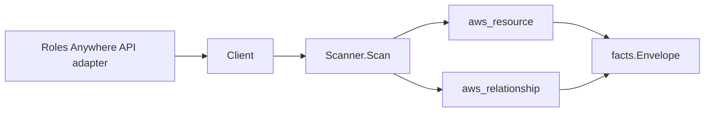

# AWS IAM Roles Anywhere Scanner

## Purpose

`internal/collector/awscloud/services/rolesanywhere` owns the AWS IAM Roles
Anywhere scanner contract for the AWS cloud collector. It converts trust anchor,
profile, and imported certificate-revocation-list (CRL) metadata into
`aws_resource` facts and emits relationship evidence for the profile-to-IAM-role,
trust-anchor-to-ACM-PCA, and CRL-to-trust-anchor dependencies.

## Ownership boundary

This package owns scanner-level Roles Anywhere fact selection and identity
mapping. It does not own AWS SDK pagination, STS credentials, workflow claims,
fact persistence, graph writes, reducer admission, or query behavior.

## Exported surface

See `doc.go` for the godoc contract.

- `Client` - minimal Roles Anywhere metadata read surface consumed by `Scanner`.
- `Scanner` - emits trust anchor, profile, and CRL resources plus their
  relationships for one boundary.
- `Snapshot`, `TrustAnchor`, `Profile`, `CRL` - scanner-owned views with
  certificate material, CRL body, session policy, and credential fields
  intentionally absent.

## Dependencies

- `internal/collector/awscloud` for boundaries, resource constants, relationship
  constants, partition helpers, and envelope builders.
- `internal/facts` for emitted fact envelope kinds.

The package depends on a small `Client` interface rather than the AWS SDK for Go
v2 so tests can use fake clients and the runtime adapter can own SDK behavior.

## Telemetry

This scanner emits no spans or logs directly. `awsruntime.ClaimedSource` records
scan duration and emitted resource counts after `Scanner.Scan` returns. The
`awssdk` adapter records Roles Anywhere API call counts, throttles, and
pagination spans.

## Gotchas / invariants

- Roles Anywhere facts are metadata only. The scanner must never read or persist
  certificate private material, PEM certificate bundles, CRL body bytes, inline
  session policy documents, certificate attribute-mapping rule contents, or
  vended session credentials.
- The profile-to-IAM-role edge is keyed by the IAM role ARN AWS reports on the
  profile, which matches how the IAM scanner publishes its role resource_id, so
  the edge joins the IAM role node instead of dangling. Duplicate and blank role
  ARNs are dropped.
- The trust-anchor-to-ACM-PCA edge is emitted only for trust anchors whose
  source is `AWS_ACM_PCA` and that report a CA ARN. The target is keyed by that
  CA ARN, which matches how the acmpca scanner publishes its
  certificate-authority resource_id.
- The CRL-to-trust-anchor edge is emitted only when AWS reports an associated
  trust-anchor ARN. The target is keyed by that trust-anchor ARN, which is the
  resource_id the trust-anchor node publishes (an internal edge).
- The scanner never synthesizes an ARN. It forwards reported ARNs verbatim, so
  GovCloud (`aws-us-gov`) and China (`aws-cn`) partition ARNs are preserved and
  never rewritten to a literal `arn:aws:`.
- Emit reported evidence only. Do not infer deployment, workload, repository
  ownership, environment, or deployable-unit truth from trust anchor, profile,
  or CRL names, or AWS tags.

## Evidence

Collector Performance Evidence:
`go test ./internal/collector/awscloud/services/rolesanywhere/...` covers the
bounded Roles Anywhere metadata path: one paginated ListTrustAnchors stream, one
paginated ListProfiles stream, one paginated ListCrls stream, one
ListTagsForResource point read per resource, no CRL body reads, no subject or
credential reads, no mutations, and no graph writes in the collector.

No-Regression Evidence: metadata-only control-plane scanner; new read path, no change to existing hot paths. `go test ./internal/collector/awscloud/services/rolesanywhere/...` green.

No-Observability-Change: reuses shared AWS pagination span + API-call/throttle counters; no telemetry contract change.

Collector Deployment Evidence: Roles Anywhere runs inside the existing hosted
`collector-aws-cloud` runtime, so `/healthz`, `/readyz`, `/metrics`, and
`/admin/status` stay covered by the command wiring and Helm collector runtime.

## Related docs

- `docs/public/services/collector-aws-cloud.md`
- `docs/public/services/collector-aws-cloud-scanners.md`
- `docs/public/services/collector-aws-cloud-security.md`
