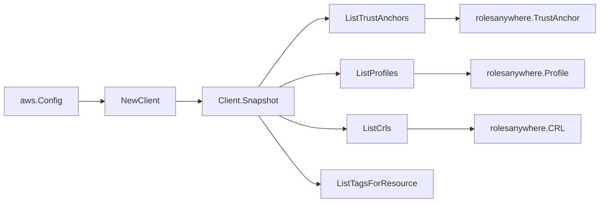

# AWS IAM Roles Anywhere SDK Adapter

## Purpose

`internal/collector/awscloud/services/rolesanywhere/awssdk` adapts AWS SDK for
Go v2 Roles Anywhere responses to the scanner-owned `Client` contract. It owns
trust-anchor pagination, profile pagination, CRL pagination, resource-tag reads,
throttle classification, and per-call AWS API telemetry.

## Ownership boundary

This package owns SDK calls for Roles Anywhere. It does not own workflow claims,
credential acquisition, Roles Anywhere fact selection, graph writes, reducer
admission, or query behavior.

## Exported surface

See `doc.go` for the godoc contract.

- `Client` - AWS SDK-backed implementation of `rolesanywhere.Client`.
- `NewClient` - builds a `Client` for one claimed AWS boundary.

## Dependencies

- `internal/collector/awscloud` for account, region, and service boundary
  labels.
- `internal/collector/awscloud/services/rolesanywhere` for scanner-owned result
  types.
- `internal/telemetry` for AWS API call and throttle instruments.
- AWS SDK for Go v2 `rolesanywhere` and Smithy error contracts.

## Telemetry

Roles Anywhere paginator pages and point reads are wrapped with:

- `aws.service.pagination.page`
- `eshu_dp_aws_api_calls_total`
- `eshu_dp_aws_throttle_total`

Metric labels stay bounded to service, account, region, operation, and result.
Roles Anywhere ARNs, names, tags, and raw AWS error payloads stay out of metric
labels.

## Gotchas / invariants

- The adapter reads metadata only. It must never call `GetCrl` (which returns
  the CRL body bytes), `GetSubject`, `ListSubjects` (which expose vended session
  credentials), `CreateTrustAnchor`, `UpdateTrustAnchor`, `DeleteTrustAnchor`,
  `CreateProfile`, `UpdateProfile`, `DeleteProfile`, `ImportCrl`, `EnableCrl`,
  `DisableCrl`, or any other mutation API.
- `trustAnchorSource` extracts the source type and, for `AWS_ACM_PCA` trust
  anchors, the backing CA ARN. It deliberately ignores the PEM x509 certificate
  data carried for `CERTIFICATE_BUNDLE` trust anchors, so no certificate
  material is ever persisted.
- The CRL mapper never copies `CrlData` (the CRL body bytes); only identity,
  enabled state, and the associated trust-anchor ARN are mapped.
- The profile mapper records only a boolean `HasSessionPolicy` presence flag and
  the attribute-mapping count, never the session policy document body or the
  attribute-mapping rule contents.
- `ListTagsForResource` is a metadata read; Roles Anywhere tags carry no
  certificate or credential content.
- SDK adapters translate AWS records into scanner-owned types; scanner tests
  should not mock AWS SDK pagination.

## Related docs

- `docs/public/services/collector-aws-cloud-scanners.md`
- `docs/public/services/collector-aws-cloud-security.md`
