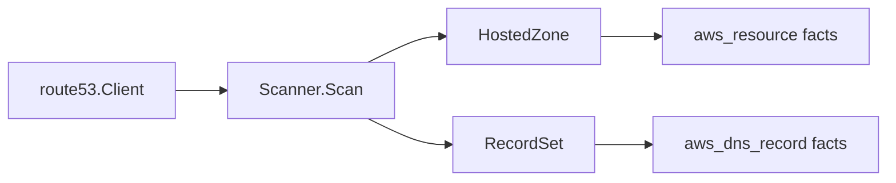

# AWS Route 53 Scanner

## Purpose

`internal/collector/awscloud/services/route53` owns scanner-side Route 53 fact
selection for the AWS cloud collector. It converts hosted zones and selected
DNS records into `aws_resource` and `aws_dns_record` facts.

The package implements the Route 53 slice from
`docs/docs/adrs/2026-04-20-aws-cloud-scanner-collector.md`.

## Ownership boundary

This package owns scanner-owned Route 53 models and fact-envelope construction.
It does not own AWS SDK calls, credentials, throttling, workflow claims, graph
writes, reducer admission, or query behavior.

## Exported surface

See `doc.go` for the godoc contract.

- `Scanner` - emits Route 53 facts for one claimed AWS boundary.
- `Client` - scanner-owned read surface implemented by `awssdk.Client`.
- `HostedZone` - scanner-owned hosted-zone record, including private/public
  visibility and raw tags.
- `RecordSet` - scanner-owned DNS record set for A, AAAA, CNAME, and alias
  evidence.
- `AliasTarget` - target DNS name and canonical hosted zone ID reported by
  Route 53.

## Dependencies

- `internal/collector/awscloud` for AWS boundaries and fact envelopes.
- `internal/facts` for durable fact envelopes.

## Telemetry

This package emits no metrics or spans directly. The `awssdk` adapter emits AWS
API call counters, throttle counters, and pagination spans.

## Gotchas / invariants

- Route 53 is a global service, but the boundary still carries the claim region
  label, commonly `aws-global`, to preserve the shared AWS claim shape.
- Hosted zones emit `aws_resource`; DNS records emit `aws_dns_record`, not
  `aws_resource`.
- Non-alias record selection is limited to A, AAAA, and CNAME. Alias record
  sets are preserved because they are high-value DNS-to-cloud evidence.
- Private/public hosted-zone visibility is direct AWS evidence and must stay on
  both hosted-zone and DNS-record facts.
- Alias targets are reported DNS evidence only. Do not infer workload,
  environment, application owner, or canonical AWS target resource here.
- NS, SOA, MX, TXT, and other non-target records are intentionally outside this
  launch slice unless they are alias records.

## Related docs

- `docs/docs/adrs/2026-04-20-aws-cloud-scanner-collector.md`
- `docs/docs/reference/telemetry/index.md`
