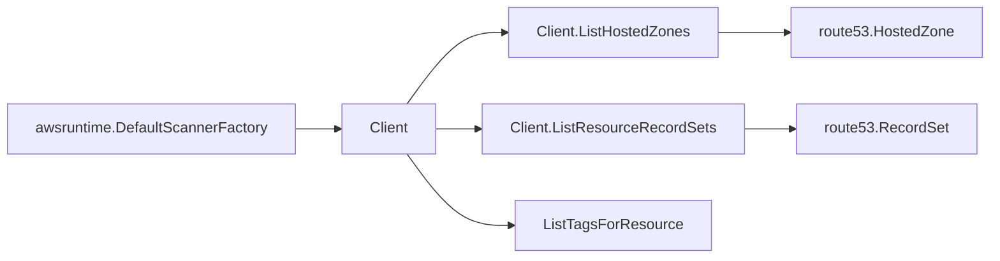

# AWS Route 53 SDK Adapter

## Purpose

`internal/collector/awscloud/services/route53/awssdk` adapts AWS SDK for Go v2
Route 53 responses to the scanner-owned `route53.Client` contract. It owns
Route 53 API pagination, hosted-zone tag reads, response mapping, throttle
classification, and per-call telemetry.

## Ownership boundary

This package owns SDK calls for Route 53. It does not own workflow claims,
credential acquisition, fact-envelope identity, graph writes, reducer
admission, or query behavior.

## Exported surface

See `doc.go` for the godoc contract.

- `Client` - Route 53 SDK adapter implementing `services/route53.Client`.
- `NewClient` - constructs a claim-scoped Route 53 adapter from AWS SDK config,
  boundary, tracer, and telemetry instruments.

## Dependencies

- AWS SDK for Go v2 `service/route53`.
- `internal/collector/awscloud` for claim boundary labels.
- `internal/collector/awscloud/services/route53` for scanner-owned target
  types.
- `internal/telemetry` for AWS API counters, throttle counters, and pagination
  spans.

## Telemetry

Route 53 paginator pages and tag point reads are wrapped with:

- `aws.service.pagination.page`
- `eshu_dp_aws_api_calls_total{service="route53",operation,result}`
- `eshu_dp_aws_throttle_total{service="route53"}`

DNS names, hosted-zone IDs, record values, and tags are never metric labels.

## Gotchas / invariants

- `ListHostedZones` uses the AWS SDK paginator. AWS returns up to 100 hosted
  zones per page.
- `ListResourceRecordSets` uses the AWS SDK paginator per hosted zone. AWS
  returns up to 300 record sets per page.
- `ListTagsForResource` requires hosted-zone IDs without the `/hostedzone/`
  prefix and `ResourceType=hostedzone`.
- The adapter only uses read APIs.

## Related docs

- `docs/docs/adrs/2026-04-20-aws-cloud-scanner-collector.md`
- `docs/docs/reference/telemetry/index.md`
