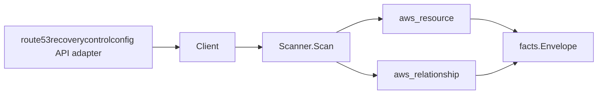

# Amazon Route 53 Application Recovery Controller Scanner

## Purpose

`internal/collector/awscloud/services/route53recoverycontrolconfig` owns the
Amazon Route 53 Application Recovery Controller recovery-control configuration
scanner contract for the AWS cloud collector. It converts cluster, control
panel, routing control, and safety rule metadata into `aws_resource` facts and
emits relationship evidence for control-panel-in-cluster,
routing-control-in-control-panel, and safety-rule-in-control-panel membership.

## Ownership boundary

This package owns scanner-level recovery-control fact selection and identity
mapping. It does not own AWS SDK pagination, STS credentials, workflow claims,
fact persistence, graph writes, reducer admission, or query behavior.

## Exported surface

See `doc.go` for the godoc contract.

- `Client` - minimal recovery-control metadata read surface consumed by
  `Scanner`.
- `Scanner` - emits cluster, control panel, routing control, and safety rule
  resources plus their membership relationships for one boundary.
- `Snapshot`, `Cluster`, `ControlPanel`, `RoutingControl`, `SafetyRule` -
  scanner-owned views with the live routing control state intentionally absent.

## Dependencies

- `internal/collector/awscloud` for boundaries, resource constants,
  relationship constants, and envelope builders.
- `internal/facts` for emitted fact envelope kinds.

The package depends on a small `Client` interface rather than the AWS SDK for
Go v2 so tests can use fake clients and the runtime adapter can own SDK
behavior.

## Telemetry

This scanner emits no spans or logs directly. `awsruntime.ClaimedSource`
records scan duration and emitted resource counts after `Scanner.Scan` returns.
The `awssdk` adapter records recovery-control API call counts, throttles, and
pagination spans.

## Gotchas / invariants

- Recovery-control facts are metadata only. The scanner must never read or set
  the live routing control On/Off state (which lives behind the separate
  route53recoverycluster data plane) and must never call any mutation API.
- Every node publishes its resource_id as the AWS-reported ARN (falling back to
  the resource name). All three membership edges are internal to this scanner
  and are keyed by the parent's ARN, so they join the cluster or control panel
  node this same scanner emits instead of dangling.
- Route 53 ARC is a global/recovery service. Every reported ARN comes from the
  API already partition-correct and is used directly as the join key, so
  GovCloud and China resources join their real nodes; `arn:aws:` is never
  synthesized or hardcoded.
- Cluster endpoint URLs are never persisted; only the endpoint Region names
  survive, because the URLs are handles to the routing control state data plane.
- Safety rules record rule logic (type, threshold, inverted flag, wait period)
  and routing control counts only, never application traffic.
- Emit reported evidence only. Do not infer deployment, workload, repository
  ownership, environment, or deployable-unit truth from resource names or AWS
  tags.

## Evidence

Collector Performance Evidence:
`go test ./internal/collector/awscloud/services/route53recoverycontrolconfig/...`
covers the bounded recovery-control metadata path: one paginated ListClusters
stream, one paginated ListControlPanels stream per cluster, one paginated
ListRoutingControls and one paginated ListSafetyRules stream per control panel,
one ListTagsForResource point read per resource, no routing control state reads,
and no graph writes in the collector.

No-Regression Evidence: metadata-only control-plane scanner; new read path, no change to existing hot paths. `go test ./internal/collector/awscloud/services/route53recoverycontrolconfig/...` green.

No-Observability-Change: reuses shared AWS pagination span + API-call/throttle counters; no telemetry contract change.

Collector Deployment Evidence: the scanner runs inside the existing hosted
`collector-aws-cloud` runtime, so `/healthz`, `/readyz`, `/metrics`, and
`/admin/status` stay covered by the command wiring and Helm collector runtime.

## Related docs

- `docs/public/services/collector-aws-cloud.md`
- `docs/public/services/collector-aws-cloud-scanners.md`
- `docs/public/services/collector-aws-cloud-security.md`
