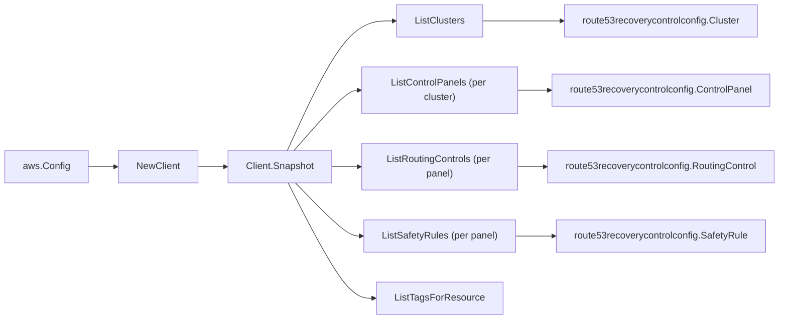

# Amazon Route 53 Application Recovery Controller SDK Adapter

## Purpose

`internal/collector/awscloud/services/route53recoverycontrolconfig/awssdk`
adapts AWS SDK for Go v2 Route 53 Application Recovery Controller
recovery-control configuration responses to the scanner-owned `Client` contract.
It owns cluster pagination, per-cluster control-panel pagination, per-panel
routing-control and safety-rule pagination, resource-tag reads, throttle
classification, and per-call AWS API telemetry.

## Ownership boundary

This package owns SDK calls for recovery-control configuration. It does not own
workflow claims, credential acquisition, recovery-control fact selection, graph
writes, reducer admission, or query behavior.

## Exported surface

See `doc.go` for the godoc contract.

- `Client` - AWS SDK-backed implementation of
  `route53recoverycontrolconfig.Client`.
- `NewClient` - builds a `Client` for one claimed AWS boundary.

## Dependencies

- `internal/collector/awscloud` for account, region, and service boundary
  labels.
- `internal/collector/awscloud/services/route53recoverycontrolconfig` for
  scanner-owned result types.
- `internal/telemetry` for AWS API call and throttle instruments.
- AWS SDK for Go v2 `route53recoverycontrolconfig` and Smithy error contracts.

## Telemetry

Recovery-control paginator pages and point reads are wrapped with:

- `aws.service.pagination.page`
- `eshu_dp_aws_api_calls_total`
- `eshu_dp_aws_throttle_total`

Metric labels stay bounded to service, account, region, operation, and result.
Recovery-control ARNs, names, tags, and raw AWS error payloads stay out of
metric labels.

## Gotchas / invariants

- The route53recoverycontrolconfig endpoint is global; the SDK pins it to
  us-west-2. A single claim observes every cluster regardless of boundary Region.
- The adapter reads metadata only. It must never call
  `UpdateRoutingControlState` (the route53recoverycluster data-plane module is
  never imported), `CreateCluster`, `DeleteCluster`, `CreateControlPanel`,
  `UpdateControlPanel`, `DeleteControlPanel`, `CreateRoutingControl`,
  `UpdateRoutingControl`, `DeleteRoutingControl`, `CreateSafetyRule`,
  `UpdateSafetyRule`, `DeleteSafetyRule`, `TagResource`, `UntagResource`, or any
  other mutation API. The exclusion test fails the build if one ever appears.
- A `ListSafetyRules` entry is a union of an assertion rule or a gating rule. The
  adapter maps whichever shape is present and skips an entry that carries
  neither; it never invents a rule.
- Cluster endpoint URLs are dropped during mapping; only endpoint Region names
  survive, because the URLs are handles to the routing control state data plane.
- `ListTagsForResource` is a metadata read; recovery-control tags carry no state.
- SDK adapters translate AWS records into scanner-owned types; scanner tests
  should not mock AWS SDK pagination.

## Related docs

- `docs/public/services/collector-aws-cloud-scanners.md`
- `docs/public/services/collector-aws-cloud-security.md`
