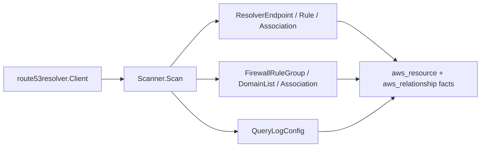

# AWS Route 53 Resolver Scanner

## Purpose

`internal/collector/awscloud/services/route53resolver` owns scanner-side Route
53 Resolver fact selection for the AWS cloud collector. It converts resolver
endpoints, resolver rules and rule associations, DNS Firewall rule groups and
domain lists, firewall rule group associations, and query log configurations
into `aws_resource` and `aws_relationship` facts.

This is distinct from the `route53` scanner, which owns hosted zones and DNS
records. This slice owns DNS resolution endpoints and DNS Firewall metadata.

## Ownership boundary

This package owns scanner-owned Route 53 Resolver models, fact-envelope
construction, and relationship selection. It does not own AWS SDK calls,
credentials, throttling, workflow claims, graph writes, reducer admission, or
query behavior. VPCs and subnets are owned by the EC2 scanner; this scanner
crosses to them by AWS-reported identifier only.

## Exported surface

See `doc.go` for the godoc contract.

- `Scanner` - emits Route 53 Resolver facts for one claimed AWS boundary.
- `Client` - scanner-owned, metadata-only read surface implemented by
  `awssdk.Client`.
- `ResolverEndpoint`, `ResolverRule`, `ResolverRuleAssociation`,
  `FirewallRuleGroup`, `FirewallDomainList`, `FirewallRuleGroupAssociation`,
  `QueryLogConfig` - scanner-owned record types.

## Dependencies

- `internal/collector/awscloud` for AWS boundaries and fact envelopes.
- `internal/facts` for durable fact envelopes.

## Telemetry

This package emits no metrics or spans directly. The `awssdk` adapter emits AWS
API call counters, throttle counters, and pagination spans.

## Gotchas / invariants

- Route 53 Resolver is a regional service, so the boundary carries the real
  claim region, unlike the global `route53` scanner.
- DNS Firewall domain list contents are never read or persisted; only the
  AWS-reported `domain_count` survives. The SDK adapter omits
  `ListFirewallDomains` from its read surface by construction.
- DNS Firewall rule bodies are never read; only the AWS-reported `rule_count`
  survives. The adapter omits `ListFirewallRules`.
- Resolver endpoint IP address strings are never carried. The scanner derives
  subnet relationships from the IP addresses and keeps only the AWS-reported
  `ip_address_count`.
- Resolver rules carry name, domain name, and rule type (FORWARD, SYSTEM,
  RECURSIVE) only; forwarded target query data (`TargetIps`) is never carried.
- Query log configurations carry the destination ARN only; query log records
  are never read.
- Relationships always set a non-empty `target_type` and a join key:
  endpoint-to-VPC and endpoint-to-subnet target `aws_ec2_vpc` and
  `aws_ec2_subnet`; rule-to-endpoint targets `aws_route53resolver_endpoint`;
  rule-association-to-VPC and firewall-rule-group-association-to-VPC target
  `aws_ec2_vpc`.
- The scanner stops on client errors and wraps them with `%w`. Runtime adapters
  decide whether an AWS service error is retryable, terminal, or a warning fact.

## Evidence

Collector Performance Evidence: `go test ./internal/collector/awscloud/services/route53resolver/...`
covers the bounded Route 53 Resolver metadata path: one paginated
ListResolverEndpoints stream with a per-endpoint paginated
ListResolverEndpointIpAddresses fan-out for subnet derivation, one paginated
ListResolverRules stream, one paginated ListResolverRuleAssociations stream, one
paginated ListFirewallRuleGroups stream with a per-group GetFirewallRuleGroup
count read, one paginated ListFirewallDomainLists stream with a per-list
GetFirewallDomainList count read, one paginated
ListFirewallRuleGroupAssociations stream, and one paginated
ListResolverQueryLogConfigs stream. No mutation, domain-content, or
query-log-record API is reachable, and the collector performs no graph writes.

No-Regression Evidence: `go test ./cmd/collector-aws-cloud ./internal/collector/awscloud/...`
covers resolver endpoint, rule, rule association, firewall rule group, firewall
domain list, firewall rule group association, and query log config fact
emission; every relationship's non-empty target type and join key; domain-list
count-not-contents and rule-group count-not-rules structural assertions;
query-log destination-only assertion; resolver-rule forwarded-query-data
exclusion; endpoint IP-count-not-addresses assertion; runtime registration; and
command configuration without a redaction key. The SDK adapter reflection
contract tests prove the mutation APIs, `ListFirewallDomains`, and
`ListFirewallRules` are unreachable.

Collector Observability Evidence: Route 53 Resolver uses the existing AWS
collector `aws.service.pagination.page` span plus `eshu_dp_aws_api_calls_total`,
`eshu_dp_aws_throttle_total`,
`eshu_dp_aws_resources_emitted_total{service="route53resolver"}`,
`eshu_dp_aws_relationships_emitted_total`, and `aws_scan_status` rows. Metric
labels stay bounded to service, account, region, operation, result, and
resource type.

No-Observability-Change: the existing AWS collector telemetry contract already
diagnoses Route 53 Resolver scans through `aws.service.scan`,
`aws.service.pagination.page`, API/throttle counters, resource/relationship
counters, and `aws_scan_status`. No new instrument or label was added.

Collector Deployment Evidence: Route 53 Resolver runs inside the existing
hosted `collector-aws-cloud` runtime, so `/healthz`, `/readyz`, `/metrics`, and
`/admin/status` stay covered by the command wiring and the Helm collector
runtime. No new ServiceMonitor, port, or deployment surface is introduced.

## Related docs

- `docs/public/services/collector-aws-cloud-scanners.md`
- `docs/public/reference/telemetry/index.md`
