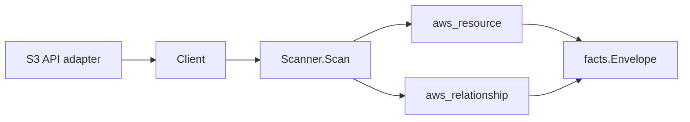

# AWS S3 Scanner

## Purpose

`internal/collector/awscloud/services/s3` owns the Amazon S3 scanner contract
for the AWS cloud collector. It converts bucket control-plane metadata into
`aws_resource` facts and emits relationship evidence when S3 reports a bucket
server-access-log target bucket.

## Ownership boundary

This package owns scanner-level S3 fact selection and identity mapping. It does
not own AWS SDK pagination, STS credentials, workflow claims, fact persistence,
graph writes, reducer admission, or query behavior.

## Exported surface

See `doc.go` for the godoc contract.

- `Client` - minimal S3 bucket metadata read surface consumed by `Scanner`.
- `Scanner` - emits bucket resources and logging-target relationship facts for
  one boundary.
- `Bucket` - scanner-owned bucket representation with safe metadata only.
- `Versioning`, `Encryption`, `PublicAccessBlock`, `Website`, and `Logging` -
  scanner-owned control-plane metadata groups.

## Dependencies

- `internal/collector/awscloud` for boundaries, resource constants,
  relationship constants, and envelope builders.
- `internal/facts` for emitted fact envelope kinds.

The package depends on a small `Client` interface rather than the AWS SDK for Go
v2 so tests can use fake clients and runtime adapters can own SDK behavior.

## Telemetry

This scanner emits no spans or logs directly. `awsruntime.ClaimedSource`
records scan duration and emitted resource counts after `Scanner.Scan` returns.
The `awssdk` adapter records S3 API call counts, throttles, and pagination
spans.

## Gotchas / invariants

- S3 facts are metadata only. The scanner must not read objects, list object
  keys, mutate buckets, or persist object inventory.
- Bucket policy JSON, ACL grants, replication rules, lifecycle rules,
  notification configuration, inventory configuration, analytics configuration,
  and metrics configuration are not persisted.
- Website configuration is reduced to status flags, redirect host, and routing
  rule count. Index and error document object keys are not persisted.
- Logging target grants and object-key format are not persisted. The scanner
  records only the target bucket and target prefix needed for relationship
  evidence.
- Tags are raw AWS tag evidence. Do not infer environment, owner, workload, or
  deployable-unit truth from tags in this package.

## Evidence

Collector Performance Evidence: `go test ./internal/collector/awscloud/services/s3/...`
covers the bounded S3 metadata path: regional paginated ListBuckets with
MaxBuckets set, HeadBucket,
GetBucketTagging, GetBucketVersioning, GetBucketEncryption,
GetPublicAccessBlock, GetBucketPolicyStatus, GetBucketOwnershipControls,
GetBucketWebsite, and GetBucketLogging; no object inventory calls, no policy
JSON reads, no ACL grant reads, no mutations, and no graph writes in the
collector.

No-Regression Evidence: `go test ./cmd/collector-aws-cloud ./internal/collector/awscloud/...`
covers S3 bucket metadata fact emission, logging-target relationship emission,
omission of object/policy/ACL/replication/lifecycle/notification fields, runtime
registration, command configuration, and the SDK adapter's safe metadata
mapping.

Collector Observability Evidence: S3 uses the existing AWS collector
`aws.service.pagination.page` span plus `eshu_dp_aws_api_calls_total`,
`eshu_dp_aws_throttle_total`, `eshu_dp_aws_resources_emitted_total`,
`eshu_dp_aws_relationships_emitted_total`, and `aws_scan_status` rows. Metric
labels stay bounded to service, account, region, operation, result, and status.

No-Observability-Change: the existing AWS collector telemetry contract already
diagnoses S3 scans through `aws.service.scan`, `aws.service.pagination.page`,
API/throttle counters, resource/relationship counters, and `aws_scan_status`.

### Partition-aware bucket node identity (#862, keystone)

No-Regression Evidence: `go test ./internal/collector/awscloud/services/s3/... -count=1`
covers the new `TestBucketNodeIdentityDerivesPartition`,
`TestLoggingRelationshipDerivesPartition`, and `TestBucketARNDerivesPartition`
(commercial / `aws-us-gov` / `aws-cn` / blank-region-fallback) alongside the
existing commercial assertions in `scanner_test.go` / `awssdk/client_test.go`.
S3 buckets carry no API ARN, so the scanner synthesizes the node `ARN`,
`ResourceID`, ARN correlation anchor, and bucket->bucket logging endpoints; these
now derive the partition from the claim region (`partitionForRegion` in the SDK
adapter, `partition(boundary)` in the scanner) instead of hardcoding `aws`. This
is the keystone for the partition graph-join class: every partition-aware
consumer (Bedrock, CodePipeline, MQ, Config, SageMaker/Glue #859, Athena #861)
emits `arn:<partition>:s3:::<bucket>` targets and only resolves once the bucket
node carries the matching partition. Commercial output is byte-for-byte
unchanged; metadata-only, no graph-write or hot-path behavior change.

Node-identity note: in GovCloud/China deployments the bucket `CloudResource`
node identity (a uid input) changes from `arn:aws:s3:::<bucket>` to the
partition-correct ARN. Within a single-partition deployment there is no
migration — buckets are materialized with the correct ARN from the first scan.

No-Observability-Change: the fix only changes the partition substring of the
synthesized bucket ARN value; no instrument, span, metric label, or
`aws_scan_status` row changes.

Collector Deployment Evidence: S3 runs inside the existing hosted
`collector-aws-cloud` runtime, so `/healthz`, `/readyz`, `/metrics`, and
`/admin/status` stay covered by the command wiring and Helm collector runtime.

### Partition-aware ARNs (#866)

No-Regression Evidence: `go test ./internal/collector/awscloud/services/s3/... -count=1`
keeps `TestBucketNodeIdentityDerivesPartition` and
`TestLoggingRelationshipDerivesPartition` green after the scanner and the SDK
adapter (`bucketARN`) were switched from their package-local `partition` /
`partitionForRegion` helpers to the shared `awscloud.PartitionForBoundary` and
`awscloud.PartitionForRegion`. The derivation logic is identical; commercial
output (`us-east-1`) is byte-for-byte unchanged; this is a metadata-only
consolidation with no graph-write, queue, or hot-path behavior change.

No-Observability-Change: the change only swaps helpers; the synthesized bucket
ARN value is unchanged for every region, and no instrument, span, metric label,
or `aws_scan_status` row changes.

## Related docs

- `docs/public/services/collector-aws-cloud.md`
- `docs/public/guides/collector-authoring.md`
