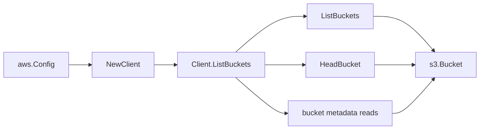

# AWS S3 SDK Adapter

## Purpose

`internal/collector/awscloud/services/s3/awssdk` adapts AWS SDK for Go v2 S3
responses to the scanner-owned `Client` contract. It owns bucket pagination,
bucket control-plane point reads, throttle classification, and per-call AWS API
telemetry.

## Ownership boundary

This package owns SDK calls for S3. It does not own workflow claims, credential
acquisition, S3 fact selection, graph writes, reducer admission, or query
behavior.

## Exported surface

See `doc.go` for the godoc contract.

- `Client` - AWS SDK-backed implementation of `s3.Client`.
- `NewClient` - builds a `Client` for one claimed AWS boundary.

## Dependencies

- `internal/collector/awscloud` for account, region, and service boundary
  labels.
- `internal/collector/awscloud/services/s3` for scanner-owned result types.
- `internal/telemetry` for AWS API call and throttle instruments.
- AWS SDK for Go v2 `s3` and Smithy error contracts.

## Telemetry

S3 list pages and point reads are wrapped with:

- `aws.service.pagination.page`
- `eshu_dp_aws_api_calls_total`
- `eshu_dp_aws_throttle_total`

Metric labels stay bounded to service, account, region, operation, and result.
Bucket ARNs, bucket names, tags, object prefixes, KMS key IDs, and raw AWS error
payloads stay out of metric labels.

## Gotchas / invariants

- ListBuckets discovers buckets for the claimed region. HeadBucket confirms the
  bucket region when the list response omits it.
- Optional missing configurations such as missing tag sets, website
  configuration, public access block, ownership controls, and bucket policy
  status are mapped to empty metadata.
- GetBucketPolicyStatus is allowed because it returns only public/not-public
  status; GetBucketPolicy is not allowed because it returns policy JSON.
- GetBucketWebsite is reduced to booleans, redirect host, and routing-rule
  count. The adapter discards index and error document object keys.
- GetBucketLogging records target bucket and prefix only. Target grants and
  object-key format are discarded.
- The adapter must not call GetObject, ListObjects, ListObjectsV2,
  ListObjectVersions, GetBucketPolicy, GetBucketAcl, GetBucketReplication,
  GetBucketLifecycleConfiguration, GetBucketNotificationConfiguration,
  GetBucketInventoryConfiguration, GetBucketAnalyticsConfiguration,
  GetBucketMetricsConfiguration, or mutation APIs.

## Related docs

- `docs/docs/adrs/2026-04-20-aws-cloud-scanner-collector.md`
- `docs/docs/guides/collector-authoring.md`
