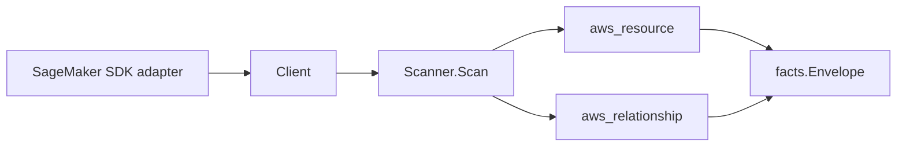

# AWS SageMaker Scanner

## Purpose

`internal/collector/awscloud/services/sagemaker` owns the SageMaker scanner
contract for the AWS cloud collector. It converts control-plane metadata for
fifteen SageMaker resource types into `aws_resource` facts and emits the
reported relationships that tie models, endpoints, jobs, notebooks, and Studio
domains to their dependencies.

In scope: notebook instances, models, endpoints, endpoint configs, training
jobs, processing jobs, transform jobs, hyperparameter tuning jobs, projects,
pipelines, feature groups, Studio domains, user profiles, apps, and inference
components.

## Ownership boundary

This package owns scanner-level SageMaker fact selection and identity mapping.
It does not own AWS SDK pagination, STS credentials, workflow claims, fact
persistence, graph writes, reducer admission, or query behavior. The SDK
adapter in `awssdk` owns every AWS call; this package consumes the small
`Client` interface only.

## Exported surface

See `doc.go` for the godoc contract.

- `Client` - the metadata-only SageMaker read surface consumed by `Scanner`.
  It exposes only `List*` reads; it has no inference call and no mutation.
- `Scanner` - emits resource and relationship facts for one boundary.
- The scanner-owned resource models (`NotebookInstance`, `Model`, `Endpoint`,
  `EndpointConfig`, `TrainingJob`, `ProcessingJob`, `TransformJob`,
  `HyperParameterTuningJob`, `Project`, `Pipeline`, `FeatureGroup`, `Domain`,
  `UserProfile`, `App`, `InferenceComponent`). None of them carry a field for a
  forbidden payload, so a forbidden value has nowhere to land.

## Dependencies

- `internal/collector/awscloud` for boundaries, resource constants,
  relationship constants, and envelope builders.
- `internal/facts` for emitted fact envelope kinds.

The package depends on the `Client` interface rather than the AWS SDK for Go v2
so tests use fake clients and the runtime adapter owns SDK behavior.

## Telemetry

This scanner emits no spans or logs directly. `awsruntime.ClaimedSource`
records scan duration and emitted resource counts after `Scanner.Scan` returns,
labeled `service="sagemaker"` on `eshu_dp_aws_resources_emitted_total` and
`eshu_dp_aws_relationships_emitted_total`. The `awssdk` adapter records
SageMaker API call counts, throttles, and pagination spans.

## Gotchas / invariants

- The scanner is metadata-only. It never invokes endpoints (InvokeEndpoint /
  InvokeEndpointAsync) and never mutates SageMaker state.
- The scanner never persists hyperparameter values (training or tuning),
  training/processing/transform input or output data references, notebook
  lifecycle-config script bodies, container environment maps, or pipeline
  definition bodies. These are excluded by omission from the scanner-owned
  types, not by post-hoc redaction.
- Relationships are emitted only when AWS reports both endpoints of the edge.
  IAM-role and S3-artifact targets are guarded so a free-form name is never
  emitted as an ARN.
- Studio user profiles and apps have no ARN in their list summary; the scanner
  builds a stable synthetic id from the parent domain and profile/app name.
- Tags are raw AWS tag evidence. Do not infer environment, owner, workload, or
  deployable-unit truth from tags or resource names in this package.

## Evidence

Collector Performance Evidence: `go test ./internal/collector/awscloud/services/sagemaker/... -count=1 -race`
covers the bounded SageMaker metadata path. The SDK adapter API fanout per
claim is: one paginated `List*` per resource type (15 lists), one targeted
`Describe*` per resource that owns a required relationship (notebook, model,
endpoint, endpoint-config, domain, training job), and one `ListTags` per
ARN-bearing resource. Processing/transform/tuning jobs, projects, pipelines,
feature groups, user profiles, apps, and inference components are emitted from
list summaries with no Describe fanout. There is no graph write, queue, lease,
or worker change: the scanner returns a fact slice for the existing claim
runtime to commit, so this slice adds no new concurrency surface.

No-Regression Evidence: `go test ./internal/collector/awscloud/services/sagemaker/... ./internal/collector/awscloud/awsruntime/... ./cmd/collector-aws-cloud/... -count=1`
covers resource fact emission for all 15 types, the eight required
relationships, sensitive-payload omission, the reflection gate proving
InvokeEndpoint and mutation methods are unreachable, runtime self-registration
through the derived guard, and command-side SageMaker target validation.

Collector Observability Evidence: SageMaker uses the existing AWS collector
`aws.service.pagination.page` span plus `eshu_dp_aws_api_calls_total`,
`eshu_dp_aws_throttle_total`, `eshu_dp_aws_resources_emitted_total{service="sagemaker"}`,
`eshu_dp_aws_relationships_emitted_total`, and `aws_scan_status` rows. Metric
labels stay bounded to service, account, region, operation, result, and status.

No-Observability-Change: the existing AWS collector telemetry contract already
diagnoses SageMaker scans through `aws.service.scan`,
`aws.service.pagination.page`, API/throttle counters, resource/relationship
counters, and `aws_scan_status`. This scanner adds no new instrument.

### Partition-aware S3 artifact join (#816)

No-Regression Evidence: `go test ./internal/collector/awscloud/services/sagemaker/... -count=1`
covers the new `TestModelArtifactRelationshipDerivesPartition` (commercial /
`aws-us-gov` / `aws-cn` / missing-ARN-fallback) alongside the existing
`TestScannerModelRelationshipsTargetTypes` commercial assertion. The
model->S3-artifact target ARN now derives its partition from the model ARN via
`arnPartition` instead of hardcoding `aws`, so GovCloud and China joins resolve
to the bucket node the S3 scanner publishes (`arn:<partition>:s3:::<bucket>`)
instead of dangling. Commercial-partition output is byte-for-byte unchanged;
this is a metadata-only correctness fix with no graph-write, queue, or hot-path
behavior change.

No-Observability-Change: the fix only changes the partition substring of a
synthesized target ARN value; no instrument, span, metric label, or
`aws_scan_status` row changes.

Collector Deployment Evidence: SageMaker runs inside the existing hosted
`collector-aws-cloud` runtime, so `/healthz`, `/readyz`, `/metrics`, and
`/admin/status` stay covered by the command wiring and Helm collector runtime.

### Partition-aware ARNs (#866)

No-Regression Evidence: `go test ./internal/collector/awscloud/services/sagemaker/... -count=1`
keeps the `#816` model-artifact partition assertions green after the synthesized
S3 bucket ARN was switched from the package-local `arnPartition` helper to the
shared `awscloud.PartitionFromARN`. The derivation logic is identical; the
bucket ARN still inherits the partition of the referencing model ARN.
Commercial output is byte-for-byte unchanged; this is a metadata-only
consolidation with no graph-write, queue, or hot-path behavior change.

No-Observability-Change: the change only swaps a helper; the synthesized ARN
value is unchanged, and no instrument, span, metric label, or `aws_scan_status`
row changes.

## Related docs

- `docs/public/services/collector-aws-cloud-scanners.md`
- `docs/public/guides/collector-authoring.md`
