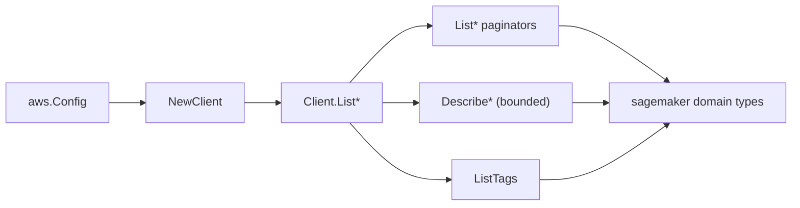

# AWS SageMaker SDK Adapter

## Purpose

`internal/collector/awscloud/services/sagemaker/awssdk` adapts AWS SDK for Go v2
SageMaker control-plane responses to the scanner-owned `sagemaker.Client`
contract. It owns SageMaker `List*` pagination, the bounded `Describe*` reads
that resolve required relationships, `ListTags` reads, throttle classification,
and per-call AWS API telemetry.

## Ownership boundary

This package owns SDK calls for SageMaker. It does not own workflow claims,
credential acquisition, SageMaker fact selection, graph writes, reducer
admission, or query behavior.

## Exported surface

See `doc.go` for the godoc contract.

- `Client` - AWS SDK-backed implementation of `sagemaker.Client`.
- `NewClient` - builds a `Client` for one claimed AWS boundary.

The adapter-local `apiClient` interface (unexported) is the auditable read
surface. `exclusion_test.go` reflects over it and fails the build if any
inference or mutation method ever appears on it.

## Dependencies

- `internal/collector/awscloud` for account, region, and service boundary
  labels.
- `internal/collector/awscloud/services/sagemaker` for scanner-owned result
  types.
- `internal/telemetry` for AWS API call and throttle instruments.
- AWS SDK for Go v2 `sagemaker` and Smithy error contracts. The adapter never
  imports `sagemakerruntime`, which is where InvokeEndpoint lives.

## Telemetry

SageMaker paginator pages and point reads are wrapped with:

- `aws.service.pagination.page`
- `eshu_dp_aws_api_calls_total`
- `eshu_dp_aws_throttle_total`

Metric labels stay bounded to service, account, region, operation, and result.
ARNs, names, tags, image URIs, and raw AWS error payloads stay out of metric
labels.

## Gotchas / invariants

- The adapter calls only `List*`, `Describe*`, and `ListTags`. It must never
  call InvokeEndpoint, InvokeEndpointAsync, or any mutation
  (Create/Delete/Stop/Update/Start/...). The reflection gate enforces this.
- `Describe*` reads copy only the fields needed for a relationship. They never
  copy `HyperParameters`, `InputDataConfig`, `OutputDataConfig`, container
  `Environment`, or any lifecycle-config or pipeline-definition body. The
  scanner-owned types have no field for those values.
- Describe fanout is bounded to the six resource types that own a required
  relationship: notebook, model, endpoint, endpoint-config, domain, and
  training job. Other resource types map straight from their list summary.
- SDK adapters translate AWS records into scanner-owned types; scanner tests
  should not mock AWS SDK paginators.

## Related docs

- `docs/public/services/collector-aws-cloud-scanners.md`
- `docs/public/guides/collector-authoring.md`
