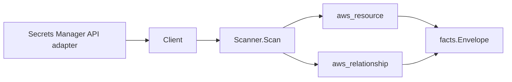

# AWS Secrets Manager Scanner

## Purpose

`internal/collector/awscloud/services/secretsmanager` owns the AWS Secrets
Manager scanner contract for the AWS cloud collector. It converts secret
control-plane metadata into `aws_resource` facts and emits relationship
evidence when AWS directly reports KMS key and rotation Lambda dependencies.

## Ownership boundary

This package owns scanner-level Secrets Manager fact selection and identity
mapping. It does not own AWS SDK pagination, STS credentials, workflow claims,
fact persistence, graph writes, reducer admission, workload ownership, or query
behavior.

## Exported surface

See `doc.go` for the godoc contract.

- `Client` - minimal Secrets Manager metadata read surface consumed by
  `Scanner`.
- `Scanner` - emits secret metadata and direct KMS/rotation Lambda relationship
  facts for one boundary.
- `Secret` - scanner-owned metadata-only secret representation.

## Dependencies

- `internal/collector/awscloud` for boundaries, resource constants,
  relationship constants, and envelope builders.
- `internal/facts` for emitted fact envelope kinds.

The package depends on a small `Client` interface rather than the AWS SDK for Go
v2 so tests can use fake clients and runtime adapters can own SDK behavior.

## Telemetry

This scanner emits no spans or logs directly. `awsruntime.ClaimedSource`
records scan duration and emitted resource counts after `Scanner.Scan` returns.
The `awssdk` adapter records Secrets Manager API call counts, throttles, and
pagination spans.

## Gotchas / invariants

- Secrets Manager facts are metadata only. The scanner must not read secret
  values, version payloads, resource policy JSON, external rotation partner
  metadata, or mutate Secrets Manager resources.
- Secret identity, description presence, KMS key identifier, rotation state,
  rotation Lambda ARN, timestamps, primary region, owning service, type, safe
  rotation schedule fields, and tags are reported control-plane metadata.
- Tags are raw AWS tag evidence. Do not infer environment, owner, workload,
  repository, or deployable-unit truth from tags in this package.
- KMS and rotation Lambda relationships are reported join evidence only.
  Correlation belongs in reducers.

## Evidence

Collector Performance Evidence: `go test ./internal/collector/awscloud/services/secretsmanager/...`
covers the bounded Secrets Manager metadata path: paginated ListSecrets with
MaxResults=100 and IncludePlannedDeletion=true; no GetSecretValue,
BatchGetSecretValue, ListSecretVersionIds, GetResourcePolicy, mutation calls,
or graph writes in the collector.

No-Regression Evidence: `go test ./cmd/collector-aws-cloud ./internal/collector/awscloud/...`
covers Secrets Manager metadata fact emission, direct KMS and rotation Lambda
relationship emission, omission of value/version/policy fields, SDK pagination,
runtime registration, command configuration, and the SDK adapter's safe
metadata mapping.

Collector Observability Evidence: Secrets Manager uses the existing AWS
collector `aws.service.pagination.page` span plus
`eshu_dp_aws_api_calls_total`, `eshu_dp_aws_throttle_total`,
`eshu_dp_aws_resources_emitted_total`,
`eshu_dp_aws_relationships_emitted_total`, and `aws_scan_status` rows. Metric
labels stay bounded to service, account, region, operation, result, and status.

No-Observability-Change: the existing AWS collector telemetry contract already
diagnoses Secrets Manager scans through `aws.service.scan`,
`aws.service.pagination.page`, API/throttle counters, resource/relationship
counters, and `aws_scan_status`.

Collector Deployment Evidence: Secrets Manager runs inside the existing hosted
`collector-aws-cloud` runtime, so `/healthz`, `/readyz`, `/metrics`, and
`/admin/status` stay covered by the command wiring and Helm collector runtime.

## Related docs

- `docs/docs/adrs/2026-04-20-aws-cloud-scanner-collector.md`
- `docs/docs/guides/collector-authoring.md`
