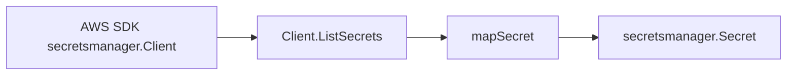

# Secrets Manager AWS SDK Adapter

## Purpose

`internal/collector/awscloud/services/secretsmanager/awssdk` adapts AWS SDK for
Go v2 Secrets Manager control-plane responses into the scanner-owned metadata
model used by `internal/collector/awscloud/services/secretsmanager`.

## Ownership boundary

This package owns Secrets Manager SDK pagination, API-call telemetry, Smithy
throttle classification, and safe response mapping. It does not own workflow
claims, credential loading, fact-envelope construction, graph writes, reducer
admission, or query behavior.

## Exported surface

See `doc.go` for the godoc contract.

- `Client` - AWS SDK-backed implementation of `secretsmanager.Client`.
- `NewClient` - builds a `Client` for one claimed AWS boundary.

## Dependencies

- `internal/collector/awscloud` for boundary identity and API-call status
  recording.
- `internal/collector/awscloud/services/secretsmanager` for scanner-owned
  metadata types.
- `internal/telemetry` for AWS collector spans and metric attributes.
- AWS SDK for Go v2 `secretsmanager` and Smithy error contracts.

## Telemetry

`Client.ListSecrets` wraps each page in `aws.service.pagination.page`, records
`eshu_dp_aws_api_calls_total`, and records `eshu_dp_aws_throttle_total` when
Smithy error codes indicate throttling. Metric labels stay bounded to service,
account, region, operation, and result.

## Gotchas / invariants

- The adapter calls ListSecrets with `MaxResults=100` and
  `IncludePlannedDeletion=true` so scheduled-deletion metadata is visible.
- The adapter must not expose `GetSecretValue`, `BatchGetSecretValue`,
  `ListSecretVersionIds`, `GetResourcePolicy`, or mutation APIs through its
  internal client interface.
- Raw descriptions are reduced to `DescriptionPresent`. Secret version maps,
  external rotation partner metadata, external rotation role ARNs, and resource
  policies stay out of scanner-owned structs.
- Tags are returned as source evidence only. Do not use them as metric labels.

## Related docs

- `../README.md`
- `docs/docs/adrs/2026-04-20-aws-cloud-scanner-collector.md`
