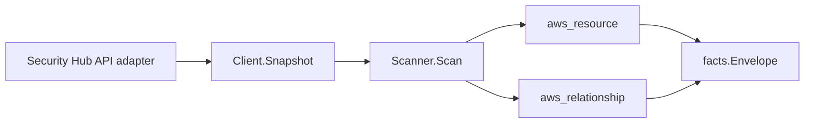

# AWS Security Hub Scanner

## Purpose

`internal/collector/awscloud/services/securityhub` owns the scanner contract for
AWS Security Hub metadata. It converts a claim-scoped Security Hub snapshot into
`aws_resource` and `aws_relationship` facts for hub configuration, enabled
standards, controls, member accounts, custom action targets, insight summaries,
and aggregate finding posture.

## Ownership boundary

This package owns scanner-level fact selection, identity mapping, and action
target description redaction. It does not own AWS SDK pagination, STS
credentials, workflow claims, fact persistence, graph writes, reducer
admission, or query behavior.

## Exported surface

See `doc.go` for the godoc contract.

- `Client` - minimal Security Hub metadata snapshot surface consumed by
  `Scanner`.
- `Scanner` - emits Security Hub metadata facts for one account and region.
- `Snapshot` - scanner-owned hub, standard, control, member, action target,
  insight, and aggregate finding-count view.
- `FindingCount` - bounded posture count grouped by standard, control,
  compliance status, severity label, and workflow status.

## Dependencies

- `internal/collector/awscloud` for boundaries, resource constants,
  relationship constants, envelope builders, and shared scalar redaction.
- `internal/facts` for emitted fact envelope kinds.
- `internal/redact` for deterministic action target description markers.

The package depends on a small `Client` interface rather than the AWS SDK for Go
v2 so scanner tests can use fake snapshots and SDK behavior stays in `awssdk`.

## Telemetry

This scanner emits no spans or logs directly. `awsruntime.ClaimedSource`
records scan duration and emitted resource counts after `Scanner.Scan` returns.
The `awssdk` adapter records Security Hub API call counts, throttles, and
pagination spans. Security Hub resources appear on
`eshu_dp_aws_resources_emitted_total{service="securityhub"}` with bounded
`resource_type` labels.

## Gotchas / invariants

- Security Hub facts are metadata only. The scanner must not call or rely on
  mutation APIs such as BatchUpdateFindings, BatchImportFindings, CreateInsight,
  DeleteInsight, UpdateInsight, EnableSecurityHub, DisableSecurityHub,
  EnableStandards, DisableStandards, CreateActionTarget, DeleteActionTarget,
  UpdateActionTarget, BatchEnableStandards, or BatchDisableStandards.
- Finding bodies never cross the scanner boundary. Resource IDs, resource
  details, remediation text, product fields, user-defined fields, note text,
  network details, and process details are out of scope.
- Insight filter expressions are out of scope because they can encode
  threat-hunting hypotheses and sensitive resource selectors.
- Finding aggregate counts are in scope when grouped by bounded posture fields:
  standard, control, compliance status, severity label, and workflow status.
- Custom action target ARNs and names are in scope. Custom action target
  descriptions must pass through the shared redaction helper before facts are
  emitted.
- Member accounts are reported evidence from Security Hub. Do not infer AWS
  Organizations ownership, workload ownership, or account hierarchy truth here.
- Tags are raw AWS tag evidence. Do not infer environment, owner, workload, or
  deployable-unit truth from tags in this package.

## Evidence

Collector Performance Evidence: `go test ./internal/collector/awscloud/services/securityhub/...`
covers the bounded Security Hub metadata path: hub read, administrator/member
enumeration, enabled standards, controls, action targets, insight summaries,
safe insight-control grouping, tag reads, and one paginated GetFindings stream
reduced to aggregate counts.

No-Regression Evidence: `go test ./cmd/collector-aws-cloud ./internal/collector/awscloud/...`
covers Security Hub fact emission, finding-body and insight-filter omission,
runtime registration, command configuration, and EventBridge freshness routing.

Collector Observability Evidence: Security Hub uses the existing AWS collector
`aws.service.pagination.page` span plus `eshu_dp_aws_api_calls_total`,
`eshu_dp_aws_throttle_total`, `eshu_dp_aws_resources_emitted_total`,
`eshu_dp_aws_relationships_emitted_total`, and `aws_scan_status` rows. Metric
labels stay bounded to service, account, region, operation, result, and
resource type; finding IDs, resource ARNs from finding bodies, tags, and
insight filters stay out of metric labels.

No-Observability-Change: the existing AWS collector telemetry contract already
diagnoses Security Hub scans through `aws.service.scan`,
`aws.service.pagination.page`, API/throttle counters, resource/relationship
counters, and `aws_scan_status`.

Collector Deployment Evidence: Security Hub runs inside the existing hosted
`collector-aws-cloud` runtime, so `/healthz`, `/readyz`, `/metrics`, and
`/admin/status` stay covered by the command wiring and Helm collector runtime.

## Related docs

- `docs/public/services/collector-aws-cloud.md`
- `docs/public/services/collector-aws-cloud-scanners.md`
- `docs/public/services/collector-aws-cloud-security.md`
- `docs/public/guides/collector-authoring.md`
