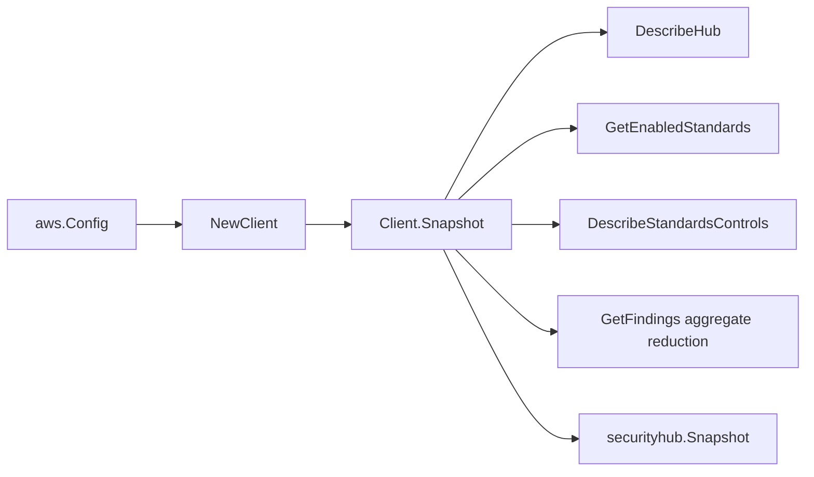

# AWS Security Hub SDK Adapter

## Purpose

`internal/collector/awscloud/services/securityhub/awssdk` adapts AWS SDK for Go
v2 Security Hub responses to the scanner-owned `Client` contract. It owns hub
reads, administrator/member enumeration, standards and control pagination,
action target pagination, insight pagination, safe insight result summaries,
finding aggregate reduction, tag reads, throttle classification, and per-call
AWS API telemetry.

## Ownership boundary

This package owns SDK calls for Security Hub. It does not own workflow claims,
credential acquisition, Security Hub fact-envelope construction, graph writes,
reducer admission, or query behavior.

## Exported surface

See `doc.go` for the godoc contract.

- `Client` - AWS SDK-backed implementation of `securityhub.Client`.
- `NewClient` - builds a `Client` for one claimed AWS boundary.

## Dependencies

- `internal/collector/awscloud` for account, region, and service boundary
  labels.
- `internal/collector/awscloud/services/securityhub` for scanner-owned result
  types.
- `internal/telemetry` for AWS API call and throttle instruments.
- AWS SDK for Go v2 `securityhub` and Smithy error contracts.

## Telemetry

Security Hub pages and point reads are wrapped with:

- `aws.service.pagination.page`
- `eshu_dp_aws_api_calls_total`
- `eshu_dp_aws_throttle_total`

Metric labels stay bounded to service, account, region, operation, and result.
Hub ARNs, standard ARNs, action target ARNs, tags, finding IDs, finding resource
selectors, insight filters, and raw AWS error payloads stay out of metric
labels.

## API allowlist

The adapter may call only:

- `DescribeHub`
- `GetAdministratorAccount`
- `ListMembers`
- `GetEnabledStandards`
- `DescribeStandardsControls`
- `DescribeActionTargets`
- `GetInsights`
- `GetInsightResults`
- `GetFindings`
- `ListTagsForResource`

`GetFindings` is used only for aggregate posture counts. Returned finding
bodies must be reduced in memory and discarded before scanner-owned snapshots
are returned.

## Gotchas / invariants

- `ListMembers` can fail for standalone or non-administrator accounts. Treat
  Security Hub membership-not-found responses as standalone/member evidence,
  but do not hide ordinary credential or permission failures.
- Insight filters are never copied into scanner-owned types. For control-grouped
  insights, only the group-by attribute and control IDs from `GetInsightResults`
  are retained.
- Finding aggregation groups by standard, control, compliance status, severity
  label, and workflow status. Never group by finding ID, resource ID, resource
  ARN, IP address, process, product field, user-defined field, or note text.
- Do not call BatchUpdateFindings, BatchImportFindings, CreateInsight,
  DeleteInsight, UpdateInsight, EnableSecurityHub, DisableSecurityHub,
  EnableStandards, DisableStandards, CreateActionTarget, DeleteActionTarget,
  UpdateActionTarget, BatchEnableStandards, or BatchDisableStandards.
- SDK adapters translate AWS records into scanner-owned types; scanner tests
  should not mock AWS SDK pagination.

## Related docs

- `docs/public/services/collector-aws-cloud.md`
- `docs/public/services/collector-aws-cloud-scanners.md`
- `docs/public/services/collector-aws-cloud-security.md`
- `docs/public/guides/collector-authoring.md`
