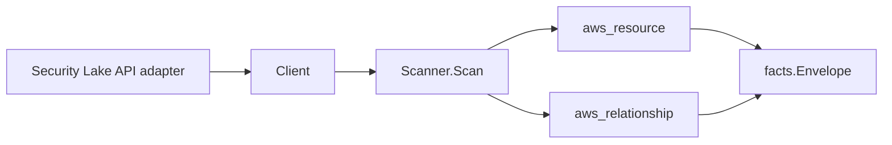

# Amazon Security Lake Scanner

## Purpose

`internal/collector/awscloud/services/securitylake` owns the Amazon Security
Lake scanner contract for the AWS cloud collector. It converts Security Lake
data lake, log source, and subscriber control-plane metadata into `aws_resource`
facts and emits relationship evidence for the data lake's backing S3 bucket, KMS
encryption key, and Lake Formation registration, log-source-in-data-lake
membership, a custom log source's log-provider IAM role, and a subscriber's
access IAM role and S3 bucket.

## Ownership boundary

This package owns scanner-level Security Lake fact selection and identity
mapping. It does not own AWS SDK pagination, STS credentials, workflow claims,
fact persistence, graph writes, reducer admission, or query behavior.

## Exported surface

See `doc.go` for the godoc contract.

- `Client` - minimal Security Lake metadata read surface consumed by `Scanner`.
- `Scanner` - emits data lake, log source, and subscriber resources plus their
  relationships for one boundary.
- `Snapshot`, `DataLake`, `LogSource`, `Subscriber` - scanner-owned views with
  ingested log records, object contents, the subscriber external id, subscriber
  endpoints, and credential material intentionally absent.

## Dependencies

- `internal/collector/awscloud` for boundaries, resource constants,
  relationship constants, partition helpers, and envelope builders.
- `internal/facts` for emitted fact envelope kinds.

The package depends on a small `Client` interface rather than the AWS SDK for
Go v2 so tests can use fake clients and the runtime adapter can own SDK
behavior.

## Telemetry

This scanner emits no spans or logs directly. `awsruntime.ClaimedSource`
records scan duration and emitted resource counts after `Scanner.Scan` returns.
The `awssdk` adapter records Security Lake API call counts, throttles, and
pagination spans.

## Gotchas / invariants

- Security Lake facts are metadata only. The scanner must never read ingested
  security log records or object contents, never persist the subscriber external
  id (a trust-establishment credential) or subscriber endpoint (a private
  notification destination), and never call a mutation API.
- The data lake node publishes its resource_id as the data lake ARN (falling
  back to a `securitylake:<region>` synthetic id). The log-source-in-data-lake
  edge is keyed by that same data lake ARN so it joins the data lake node.
- The data-lake-to-S3 and subscriber-to-S3 edges use the bucket ARN AWS already
  reports (a full, partition-correct ARN), which matches the S3 scanner's
  published bucket resource_id, so no `arn:aws:` is ever synthesized.
- The data-lake-to-KMS edge is emitted only when AWS reports a customer key
  identifier. Security Lake reports `S3_MANAGED` or `AWS_OWNED_KMS_KEY` when no
  customer key is used; those sentinels emit no edge. `target_arn` is set only
  for ARN-shaped identifiers, matching the KMS scanner's published key
  resource_id.
- The data-lake-to-Lake-Formation edge targets `aws_lakeformation_resource`
  keyed by the data lake's S3 bucket ARN, which is how the Lake Formation
  scanner publishes a registered-resource node's resource_id.
- The log-source-to-IAM-role and subscriber-to-IAM-role edges are emitted only
  for ARN-shaped role identifiers and target `aws_iam_role` keyed by the role
  ARN the IAM scanner publishes.
- No data-lake-to-Glue edge is emitted: the Security Lake API does not report a
  resolvable Glue database/table identifier on the data lake, so the edge is
  skipped rather than dangled.
- Emit reported evidence only. Do not infer deployment, workload, repository
  ownership, environment, or deployable-unit truth from data lake, source, or
  subscriber names, or AWS tags.

## Evidence

Collector Performance Evidence:
`go test ./internal/collector/awscloud/services/securitylake/...` covers the
bounded Security Lake metadata path: one ListDataLakes read scoped to the
boundary Region, one paginated ListLogSources stream, one paginated
ListSubscribers stream, no record reads, no credential reads, no mutations, and
no graph writes in the collector.

No-Regression Evidence: metadata-only control-plane scanner; new read path, no
change to existing hot paths. `go test
./internal/collector/awscloud/services/securitylake/...` green.

No-Observability-Change: reuses shared AWS pagination span + API-call/throttle
counters; no telemetry contract change.

Collector Deployment Evidence: Security Lake runs inside the existing hosted
`collector-aws-cloud` runtime, so `/healthz`, `/readyz`, `/metrics`, and
`/admin/status` stay covered by the command wiring and Helm collector runtime.

## Related docs

- `docs/public/services/collector-aws-cloud.md`
- `docs/public/services/collector-aws-cloud-scanners.md`
- `docs/public/services/collector-aws-cloud-security.md`
