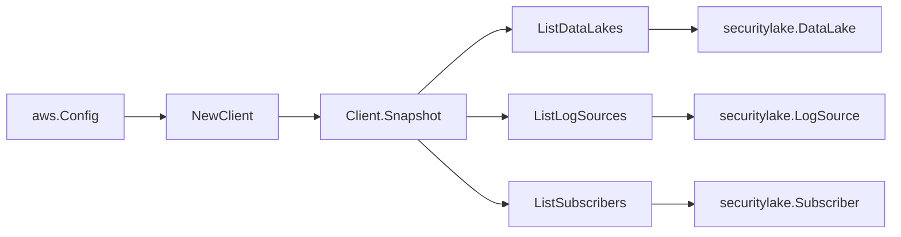

# Amazon Security Lake SDK Adapter

## Purpose

`internal/collector/awscloud/services/securitylake/awssdk` adapts AWS SDK for Go
v2 Security Lake responses to the scanner-owned `Client` contract. It owns the
data lake read, log source pagination, subscriber pagination, throttle
classification, and per-call AWS API telemetry.

## Ownership boundary

This package owns SDK calls for Security Lake. It does not own workflow claims,
credential acquisition, Security Lake fact selection, graph writes, reducer
admission, or query behavior.

## Exported surface

See `doc.go` for the godoc contract.

- `Client` - AWS SDK-backed implementation of `securitylake.Client`.
- `NewClient` - builds a `Client` for one claimed AWS boundary.

## Dependencies

- `internal/collector/awscloud` for account, region, and service boundary
  labels.
- `internal/collector/awscloud/services/securitylake` for scanner-owned result
  types.
- `internal/telemetry` for AWS API call and throttle instruments.
- AWS SDK for Go v2 `securitylake` and Smithy error contracts.

## Telemetry

Security Lake list pages are wrapped with:

- `aws.service.pagination.page`
- `eshu_dp_aws_api_calls_total`
- `eshu_dp_aws_throttle_total`

Metric labels stay bounded to service, account, region, operation, and result.
Security Lake ARNs, names, subscriber identities, and raw AWS error payloads
stay out of metric labels.

## Gotchas / invariants

- The adapter reads metadata only. It must never call `CreateDataLake`,
  `UpdateDataLake`, `DeleteDataLake`, `CreateSubscriber`, `UpdateSubscriber`,
  `DeleteSubscriber`, `GetSubscriber` (which returns the subscriber external id
  and endpoint), `CreateDataLakeExceptionSubscription`, `RegisterDataLake
  Delegated Administrator`, or any other mutation/credential-read API. The
  `apiClient` interface and the exclusion test enforce this by construction.
- `ListDataLakes` is not paginated; it is scoped to the boundary Region. The
  adapter maps each `DataLakeResource` directly, copying the S3 bucket ARN, KMS
  key id, create/update status, lifecycle expiration days, transition count, and
  replication Regions only.
- `ListLogSources` and `ListSubscribers` are paginated; the adapter pages each
  to exhaustion on `NextToken`. A `LogSource` carries a union of AWS-native and
  custom source resources; the adapter expands each into one scanner `LogSource`
  and records a custom source's log-provider IAM role ARN.
- The adapter keeps a subscriber's principal account identity but NEVER copies
  the external id or the subscriber endpoint. The `SubscriberIdentity.ExternalId`
  and `SubscriberResource.SubscriberEndpoint` SDK fields are intentionally
  dropped.
- SDK adapters translate AWS responses into scanner-owned types; scanner tests
  should not mock AWS SDK pagination.

## Related docs

- `docs/public/services/collector-aws-cloud-scanners.md`
- `docs/public/services/collector-aws-cloud-security.md`
