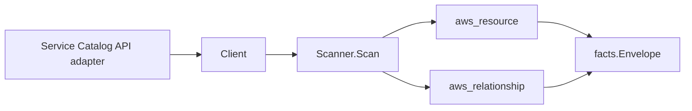

# AWS Service Catalog Scanner

## Purpose

`internal/collector/awscloud/services/servicecatalog` owns the Service Catalog
scanner contract for the AWS cloud collector. It converts portfolio, product,
and provisioned-product metadata into `aws_resource` facts and emits
relationship evidence for provisioned-product-to-CloudFormation-stack
deployment, product-to-portfolio association, and portfolio-to-IAM-role
principal grants.

## Ownership boundary

This package owns scanner-level Service Catalog fact selection and identity
mapping. It does not own AWS SDK pagination, STS credentials, workflow claims,
fact persistence, graph writes, reducer admission, or query behavior.

## Exported surface

See `doc.go` for the godoc contract.

- `Client` - minimal Service Catalog metadata read surface consumed by
  `Scanner`.
- `Scanner` - emits portfolio, product, and provisioned-product resources plus
  their relationships for one boundary.
- `Portfolio`, `Product`, `ProvisionedProduct`, `Principal` - scanner-owned
  views with provisioning parameter values, template bodies, and record outputs
  intentionally omitted.

## Dependencies

- `internal/collector/awscloud` for boundaries, resource constants,
  relationship constants, partition helpers, and envelope builders.
- `internal/facts` for emitted fact envelope kinds.

The package depends on a small `Client` interface rather than the AWS SDK for
Go v2 so tests can use fake clients and runtime adapters can own SDK behavior.

## Telemetry

This scanner emits no spans or logs directly. `awsruntime.ClaimedSource`
records scan duration and emitted resource counts after `Scanner.Scan` returns.
The `awssdk` adapter records Service Catalog API call counts, throttles, and
pagination spans.

## Gotchas / invariants

- Service Catalog facts are metadata only. The scanner must not provision,
  update, or terminate products, must not associate or disassociate principals
  or portfolios, must not mutate constraints, and must not read
  provisioning-artifact template bodies, launch-constraint policy documents,
  provisioning parameter values, or record output values.
- Portfolio, product, and provisioned-product node `resource_id` values are
  `firstNonEmpty(arn, id)`. A resource's own outgoing edges are sourced on that
  same identifier, so the edge resolves to its source node instead of dangling.
- The provisioned-product-to-CloudFormation-stack edge is emitted only for
  `CFN_STACK` provisioned products whose physical identifier is a
  CloudFormation stack ARN. The edge is ARN-keyed because the `cloudformation`
  scanner publishes a stack node's `resource_id` as the stack ARN. Terraform
  provisioned products carry non-stack physical identifiers and emit no stack
  edge.
- `ScanProvisionedProducts` does not return the physical identifier, so the SDK
  adapter resolves the stack ARN from the `SearchProvisionedProducts` index.
  Both are read-only metadata calls.
- The portfolio-to-IAM-role edge is emitted only when AWS reports a fully
  defined IAM role ARN (service segment `iam`, resource segment `role/...`).
  IAM users, groups, and `IAM_PATTERN` wildcard principals name no concrete IAM
  role node and are skipped. ARN service segments are parsed exactly (the third
  colon-delimited field), never matched as a substring of the whole ARN.
- Product-to-portfolio edges are keyed by the portfolio ARN/id the `portfolio`
  resource publishes, deduplicated per product.
- Emit reported evidence only. Do not infer deployment, workload, repository
  ownership, environment, or deployable-unit truth from portfolio, product, or
  provisioned-product names.

## Evidence

Collector Performance Evidence:
`go test ./internal/collector/awscloud/services/servicecatalog/...` covers the
bounded Service Catalog metadata path: one paginated `ListPortfolios` stream,
one `ListPrincipalsForPortfolio` stream per portfolio, one paginated
`SearchProductsAsAdmin` stream, one `ListPortfoliosForProduct` stream per
product, one paginated `ScanProvisionedProducts` stream, and one paginated
`SearchProvisionedProducts` stream to resolve stack-ARN physical identifiers.
No provisioning, association, constraint-mutation, template-read, or
record-output API is reachable, and there are no graph writes in the collector.

No-Regression Evidence:
`go test ./internal/collector/awscloud/services/servicecatalog/... ./internal/collector/awscloud/internal/relguard/... ./cmd/collector-aws-cloud/... -count=1`
covers portfolio, product, and provisioned-product metadata fact emission,
provisioned-product-to-CloudFormation-stack relationship emission gated on
`CFN_STACK` type and stack-ARN shape, product-to-portfolio relationship
emission, portfolio-to-IAM-role relationship emission gated on fully defined
role ARNs, the metadata-only client-interface exclusion reflection guard, the
relguard graph-join contract for every emitted edge, the GovCloud/China
stack-ARN partition-preservation case, runtime registration, and the SDK
adapter's safe metadata mapping including the `SearchProvisionedProducts`
physical-id stamping.

Collector Observability Evidence: Service Catalog uses the existing AWS
collector `aws.service.pagination.page` span plus `eshu_dp_aws_api_calls_total`,
`eshu_dp_aws_throttle_total`, `eshu_dp_aws_resources_emitted_total`,
`eshu_dp_aws_relationships_emitted_total`, and `aws_scan_status` rows. Metric
labels stay bounded to service, account, region, operation, result, and status.

No-Observability-Change: the existing AWS collector telemetry contract already
diagnoses Service Catalog scans through `aws.service.scan`,
`aws.service.pagination.page`, API/throttle counters, resource/relationship
counters, and `aws_scan_status`. This scanner adds no new instrument, span,
metric label, or status row.

Collector Deployment Evidence: Service Catalog runs inside the existing hosted
`collector-aws-cloud` runtime, so `/healthz`, `/readyz`, `/metrics`, and
`/admin/status` stay covered by the command wiring and Helm collector runtime.

## Related docs

- `../../README.md` - shared AWS cloud observation and envelope contract.
- `docs/public/services/collector-aws-cloud-scanners.md` - AWS collector
  service coverage and runtime requirements.
- `docs/public/guides/collector-authoring.md` - AWS scanner registration.
