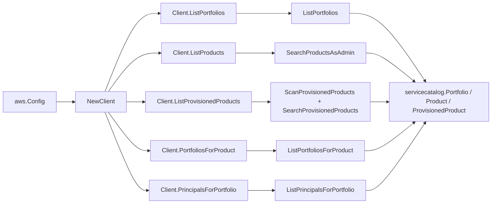

# AWS Service Catalog SDK Adapter

## Purpose

`internal/collector/awscloud/services/servicecatalog/awssdk` adapts AWS SDK for
Go v2 Service Catalog responses to the scanner-owned `Client` contract. It owns
portfolio pagination, product pagination, provisioned-product pagination, the
`SearchProvisionedProducts` physical-id index that resolves the deployed
CloudFormation stack ARN, per-product portfolio pagination, per-portfolio
principal pagination, throttle classification, and per-call AWS API telemetry.

## Ownership boundary

This package owns SDK calls for Service Catalog. It does not own workflow
claims, credential acquisition, Service Catalog fact selection, graph writes,
reducer admission, or query behavior.

## Exported surface

See `doc.go` for the godoc contract.

- `Client` - AWS SDK-backed implementation of `servicecatalog.Client`.
- `NewClient` - builds a `Client` for one claimed AWS boundary.

## Dependencies

- `internal/collector/awscloud` for account, region, and service boundary
  labels.
- `internal/collector/awscloud/services/servicecatalog` for scanner-owned result
  types.
- `internal/telemetry` for AWS API call and throttle instruments.
- AWS SDK for Go v2 `servicecatalog` and Smithy error contracts.

## Telemetry

Service Catalog paginator pages are wrapped with:

- `aws.service.pagination.page`
- `eshu_dp_aws_api_calls_total`
- `eshu_dp_aws_throttle_total`

Metric labels stay bounded to service, account, region, operation, and result.
Service Catalog ARNs, names, parameters, and raw AWS error payloads stay out of
metric labels.

## Gotchas / invariants

- `ScanProvisionedProducts` does not return the provisioned-product physical
  identifier, so the adapter builds a physical-id index from
  `SearchProvisionedProducts` and stamps the CloudFormation stack ARN onto each
  scanned detail. Both are read-only metadata calls.
- Provisioned-product scans use the `Account` access level with value `self` so
  the scanner sees every provisioned product the claim can read, not just the
  caller's own.
- The adapter must not call `ProvisionProduct`, `UpdateProvisionedProduct`,
  `TerminateProvisionedProduct`, `CreateProduct`, `UpdateProduct`,
  `DeleteProduct`, `CreatePortfolio`, `DeletePortfolio`,
  `AssociatePrincipalWithPortfolio`, `AssociateProductWithPortfolio`,
  `CreateConstraint`, `DescribeProvisioningArtifact`, `DescribeRecord`,
  `DescribeProvisioningParameters`, or any other mutation, association,
  constraint, or sensitive-payload API.
- SDK adapters translate AWS records into scanner-owned types; scanner tests
  should not mock AWS SDK pagination.

## Related docs

- `docs/public/services/collector-aws-cloud-scanners.md`
- `docs/public/services/collector-aws-cloud-security.md`
