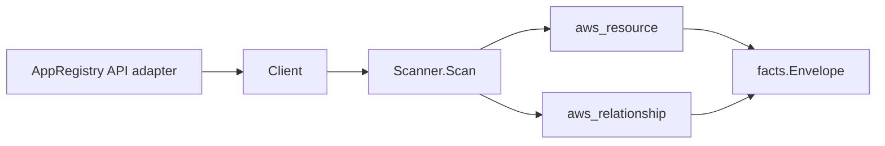

# Service Catalog AppRegistry Scanner

## Purpose

`internal/collector/awscloud/services/servicecatalogappregistry` owns the AWS
Service Catalog AppRegistry scanner contract for the AWS cloud collector. It
converts AppRegistry application and attribute-group metadata into
`aws_resource` facts and emits relationship evidence for
application-to-attribute-group membership and application-to-CloudFormation-stack
associations.

## Ownership boundary

This package owns scanner-level AppRegistry fact selection and identity mapping.
It does not own AWS SDK pagination, STS credentials, workflow claims, fact
persistence, graph writes, reducer admission, or query behavior.

## Exported surface

See `doc.go` for the godoc contract.

- `Client` - minimal AppRegistry metadata read surface consumed by `Scanner`.
- `Scanner` - emits application and attribute-group resources plus their
  relationships for one boundary.
- `Snapshot`, `Application`, `AttributeGroup`, `AssociatedResource` -
  scanner-owned views with the attribute-group content body and
  associated-resource tag values intentionally absent.

## Dependencies

- `internal/collector/awscloud` for boundaries, resource constants,
  relationship constants, and envelope builders.
- `internal/facts` for emitted fact envelope kinds.

The package depends on a small `Client` interface rather than the AWS SDK for
Go v2 so tests can use fake clients and the runtime adapter can own SDK
behavior.

## Telemetry

This scanner emits no spans or logs directly. `awsruntime.ClaimedSource`
records scan duration and emitted resource counts after `Scanner.Scan` returns.
The `awssdk` adapter records AppRegistry API call counts, throttles, and
pagination spans.

## Gotchas / invariants

- AppRegistry facts are metadata only. The scanner must never read or persist
  the attribute-group content body (the application-metadata JSON document) or
  associated-resource tag values, and must never call any mutation API.
- The application node publishes its resource_id as the application ARN
  (falling back to the application id). Its own edges are sourced on that same
  value so they resolve to the application node.
- The attribute-group node publishes its resource_id as the group ARN (falling
  back to the group id). The application-to-attribute-group edge is keyed by
  the group ARN so it joins the group node instead of dangling.
- The application-to-CloudFormation-stack edge is emitted only for CFN_STACK
  associated resources whose reported ARN is a CloudFormation stack ARN, keyed
  by that stack ARN, which matches the resource_id the `cloudformation` scanner
  publishes for a stack node. RESOURCE_TAG_VALUE associations have no scanned
  target node and are skipped rather than dangled.
- Emit reported evidence only. Do not infer deployment, workload, repository
  ownership, environment, or deployable-unit truth from application, attribute
  group, or stack names, or AWS tags.

## Evidence

Collector Performance Evidence:
`go test ./internal/collector/awscloud/services/servicecatalogappregistry/...`
covers the bounded AppRegistry metadata path: one paginated ListApplications
stream, one paginated ListAttributeGroups stream, one paginated
ListAttributeGroupsForApplication and one paginated ListAssociatedResources
stream per application, one ListTagsForResource point read per application and
per attribute group, no content-body reads, and no graph writes in the
collector.

No-Regression Evidence: metadata-only control-plane scanner; new read path, no
change to existing hot paths. `go test ./internal/collector/awscloud/services/servicecatalogappregistry/...`
green.

No-Observability-Change: reuses shared AWS pagination span + API-call/throttle
counters; no telemetry contract change.

Collector Deployment Evidence: AppRegistry runs inside the existing hosted
`collector-aws-cloud` runtime, so `/healthz`, `/readyz`, `/metrics`, and
`/admin/status` stay covered by the command wiring and Helm collector runtime.

## Related docs

- `docs/public/services/collector-aws-cloud.md`
- `docs/public/services/collector-aws-cloud-scanners.md`
- `docs/public/services/collector-aws-cloud-security.md`
