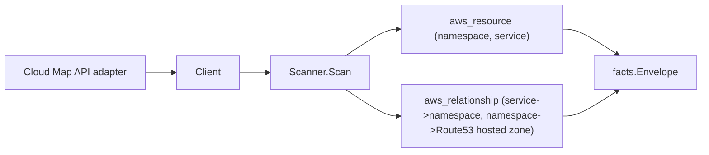

# AWS Cloud Map (Service Discovery) Scanner

## Purpose

`internal/collector/awscloud/services/servicediscovery` owns the AWS Cloud Map
(Service Discovery) scanner contract for the AWS cloud collector. It converts
namespace and service metadata into `aws_resource` facts and emits
`aws_relationship` facts for the edges Cloud Map reports directly. It is a Tier 1
dangling-edge closer: the App Mesh scanner emits a virtual-node service-discovery
edge that targets a Cloud Map service, and this scanner emits the service
resource that edge resolves to.

## Ownership boundary

This package owns scanner-level Cloud Map fact selection and identity mapping. It
does not own AWS SDK pagination, STS credentials, workflow claims, fact
persistence, graph writes, reducer admission, or query behavior.

## Exported surface

See `doc.go` for the godoc contract.

- `Client` - metadata-only Cloud Map read surface consumed by `Scanner`. One
  method, `ListNamespaceInventory`, returns the full resolved inventory.
- `Scanner` - emits Cloud Map metadata facts for one boundary. Needs no
  redaction key.
- `Namespace`, `Service`, `DNSRecord` - scanner-owned Cloud Map records.

## Dependencies

- `internal/collector/awscloud` for boundaries, resource constants,
  relationship constants, and envelope builders.
- `internal/facts` for emitted fact envelope kinds.

The package depends on a small `Client` interface rather than the AWS SDK for
Go v2 so tests can use fake clients and runtime adapters can own SDK behavior.

## Telemetry

This scanner emits no spans or logs directly. `awsruntime.ClaimedSource`
records scan duration and emitted resource counts after `Scanner.Scan` returns
(`eshu_dp_aws_resources_emitted_total{service="servicediscovery"}`). The
`awssdk` adapter records Cloud Map API call counts, throttles, and pagination
spans.

## Gotchas / invariants

- Cloud Map facts are metadata only. The scanner must never read or persist an
  instance attribute map; those maps can carry caller-defined secrets. The
  instance count comes from the Cloud Map service summary only. The SDK adapter
  never calls `ListInstances`, `GetInstance`, `GetInstancesHealthStatus`,
  `DiscoverInstances`, or `DiscoverInstancesRevision`.
- The service resource is keyed by `namespaceName/serviceName` with resource
  type `aws_cloud_map_service`. This exactly matches the App Mesh
  virtual-node-to-Cloud-Map-service edge target (`aws_cloud_map_service` keyed
  on `namespace/service`), so the edge resolves. Do not change the service
  resource id format without updating the App Mesh edge in lockstep.
- The namespace -> Route 53 hosted zone edge keys on `/hostedzone/<id>` because
  that is the resource id the route53 scanner emits. Cloud Map reports the bare
  zone id, so the relationship builder prepends the prefix.
- Cloud Map does not report the VPC for a private DNS namespace. No VPC edge is
  emitted; the VPC is reached transitively through the private Route 53 hosted
  zone, which the route53 scanner owns. Inventing a VPC edge would be wrong
  graph truth.
- Relationships always set a non-empty `target_type`.
- Tags are raw AWS tag evidence. Do not infer environment, owner, workload, or
  deployable-unit truth from tags in this package.

## Evidence

Collector Performance Evidence:
`go test ./internal/collector/awscloud/services/servicediscovery/... -count=1 -race`
covers the bounded Cloud Map metadata path: one paginated `ListNamespaces`, then
per namespace one `NAMESPACE_ID`-filtered paginated `ListServices`, and one tag
read per namespace and service; no instance reads; no mutations. Cardinality is
bounded by the namespace and service counts Cloud Map returns for the claimed
account and region.

No-Regression Evidence:
`go test ./cmd/collector-aws-cloud/... ./internal/collector/awscloud/awsruntime/... -count=1`
covers Cloud Map resource and relationship emission, the App Mesh service join
key, the Route 53 hosted-zone join key, instance-count-only recording, the SDK
mutation/instance-reader exclusion guard, runtime registration through the
derived service guard, and command configuration requiring no redaction key.

Collector Observability Evidence: Cloud Map uses the existing AWS collector
`aws.service.pagination.page` span plus `eshu_dp_aws_api_calls_total`,
`eshu_dp_aws_throttle_total`, `eshu_dp_aws_resources_emitted_total`,
`eshu_dp_aws_relationships_emitted_total`, and `aws_scan_status` rows. Metric
labels stay bounded to service, account, region, operation, result, and status.

No-Observability-Change: Cloud Map adds no new telemetry contract. The existing
AWS collector signals already diagnose Cloud Map scans through the
`aws.service.scan` and `aws.service.pagination.page` spans,
`eshu_dp_aws_api_calls_total`, `eshu_dp_aws_throttle_total`,
`eshu_dp_aws_resources_emitted_total{service="servicediscovery"}`,
`eshu_dp_aws_relationships_emitted_total{service="servicediscovery"}`, and
`aws_scan_status` rows. Cloud Map only adds the bounded
`service="servicediscovery"` label value to those existing instruments.

Collector Deployment Evidence: Cloud Map runs inside the existing hosted
`collector-aws-cloud` runtime, so `/healthz`, `/readyz`, `/metrics`, and
`/admin/status` stay covered by the command wiring and Helm collector runtime.

## Related docs

- `docs/public/services/collector-aws-cloud-scanners.md`
- `docs/public/guides/collector-authoring.md`
