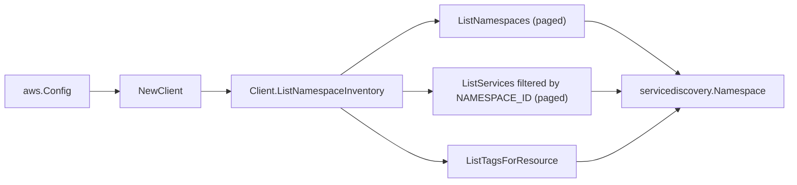

# AWS Cloud Map (Service Discovery) SDK Adapter

## Purpose

`internal/collector/awscloud/services/servicediscovery/awssdk` adapts AWS SDK
for Go v2 Cloud Map responses to the scanner-owned `servicediscovery.Client`
contract. It owns namespace list pagination, the per-namespace
NAMESPACE_ID-filtered service list pagination, resource tag reads, throttle
classification, and per-call AWS API telemetry.

## Ownership boundary

This package owns SDK calls for Cloud Map. It does not own workflow claims,
credential acquisition, Cloud Map fact selection, graph writes, reducer
admission, or query behavior.

## Exported surface

See `doc.go` for the godoc contract.

- `Client` - AWS SDK-backed implementation of `servicediscovery.Client`.
- `NewClient` - builds a `Client` for one claimed AWS boundary.

## Dependencies

- `internal/collector/awscloud` for account, region, and service boundary
  labels.
- `internal/collector/awscloud/services/servicediscovery` for scanner-owned
  result types.
- `internal/telemetry` for AWS API call and throttle instruments.
- AWS SDK for Go v2 `servicediscovery` and Smithy error contracts.

## Telemetry

Cloud Map paginator pages and tag reads are wrapped with:

- `aws.service.pagination.page`
- `eshu_dp_aws_api_calls_total`
- `eshu_dp_aws_throttle_total`

Metric labels stay bounded to service, account, region, operation, and result.
Namespace ids, service ids, names, and tags stay out of metric labels.

## Gotchas / invariants

- The adapter calls only `ListNamespaces`, `ListServices`, and
  `ListTagsForResource`.
- The internal `apiClient` interface deliberately excludes every Cloud Map
  mutation API and every instance discovery/read API (`ListInstances`,
  `GetInstance`, `GetInstancesHealthStatus`, `DiscoverInstances`,
  `DiscoverInstancesRevision`). A reflection-based test asserts the exclusion
  and FAILS if any such method ever appears, because instance attribute maps can
  carry caller-defined secrets.
- The instance count comes from the `ServiceSummary.InstanceCount` field on the
  list response. The adapter never reads an instance, so no attribute map is
  ever fetched.
- `ListServices` is scoped per namespace with a `NAMESPACE_ID` filter because the
  service summary does not carry the namespace id; the adapter supplies the
  parent namespace id and name to each service.
- `ListTagsForResource` is a single call, not paginated.
- SDK adapters translate AWS records into scanner-owned types; scanner tests
  should not mock AWS SDK paginators.

## Related docs

- `docs/public/services/collector-aws-cloud-scanners.md`
- `docs/public/guides/collector-authoring.md`
