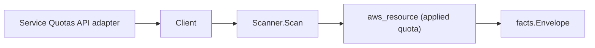

# AWS Service Quotas Scanner

## Purpose

`internal/collector/awscloud/services/servicequotas` owns the AWS Service Quotas
scanner contract for the AWS cloud collector. It converts each applied service
quota for the claimed account and region into an `aws_resource` fact, joining the
applied value against the AWS-published default so an operator can see which
quotas were raised.

## Ownership boundary

This package owns scanner-level Service Quotas fact selection and identity
mapping. It does not own AWS SDK pagination, STS credentials, workflow claims,
fact persistence, graph writes, reducer admission, or query behavior.

## Exported surface

See `doc.go` for the godoc contract.

- `Client` - minimal Service Quotas metadata read surface consumed by `Scanner`.
- `Scanner` - emits one applied-quota resource per service quota for one
  boundary.
- `Snapshot`, `ServiceQuota`, `QuotaContext`, `UsageMetric` - scanner-owned
  views with no quota-change request, usage-sample, or workload data.

## Dependencies

- `internal/collector/awscloud` for boundaries, the resource-type constant, and
  envelope builders.
- `internal/facts` for emitted fact envelope kinds.

The package depends on a small `Client` interface rather than the AWS SDK for Go
v2 so tests can use fake clients and the runtime adapter can own SDK behavior.

## Telemetry

This scanner emits no spans or logs directly. `awsruntime.ClaimedSource`
records scan duration and emitted resource counts after `Scanner.Scan` returns.
The `awssdk` adapter records Service Quotas API call counts, throttles, and
pagination spans.

## Gotchas / invariants

- Service Quotas facts are metadata only. The scanner must never request,
  modify, or delete a quota and never associate a quota-increase template.
- No relationships are emitted. A quota references an AWS service code, not a
  scanned resource, so there is no cross-service edge to key without dangling the
  graph. The service code is recorded as a quota attribute instead.
- The quota node publishes its resource_id as the quota ARN (falling back to a
  stable `<service_code>/<quota_code>` key). The ARN comes straight from the
  Service Quotas API, so no partition-aware ARN is ever synthesized and there is
  no hardcoded-partition risk.
- The override flag is durable: the SDK adapter joins the applied quota value
  against the AWS-published default from `ListAWSDefaultServiceQuotas` by quota
  code and sets `overridden` only when both values are known and differ.
- The CloudWatch usage metric is recorded as metric identity only (namespace,
  name, dimensions, recommended statistic). No metric sample value is read.
- Emit reported evidence only. Do not infer deployment, workload, repository
  ownership, or environment truth from quota names, service codes, or values.

## Evidence

No-Regression Evidence: metadata-only control-plane scanner; new read path, no change to existing hot paths. `go test ./internal/collector/awscloud/services/servicequotas/...` green.

No-Observability-Change: reuses shared AWS pagination span + API-call/throttle counters; no telemetry contract change.

Collector Performance Evidence:
`go test ./internal/collector/awscloud/services/servicequotas/...` covers the
bounded Service Quotas metadata path: one paginated ListServices stream, one
paginated ListAWSDefaultServiceQuotas stream and one paginated ListServiceQuotas
stream per service, an in-memory join by quota code, no quota-change reads, no
requests, no mutations, and no graph writes in the collector.

## Related docs

- `docs/public/services/collector-aws-cloud.md`
- `docs/public/services/collector-aws-cloud-scanners.md`
- `docs/public/services/collector-aws-cloud-security.md`
