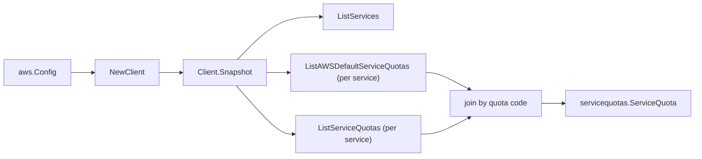

# AWS Service Quotas SDK Adapter

## Purpose

`internal/collector/awscloud/services/servicequotas/awssdk` adapts AWS SDK for
Go v2 Service Quotas responses to the scanner-owned `Client` contract. It owns
service-list pagination, per-service applied-quota pagination, per-service
default-quota pagination, the applied-vs-default join by quota code, throttle
classification, and per-call AWS API telemetry.

## Ownership boundary

This package owns SDK calls for Service Quotas. It does not own workflow claims,
credential acquisition, Service Quotas fact selection, graph writes, reducer
admission, or query behavior.

## Exported surface

See `doc.go` for the godoc contract.

- `Client` - AWS SDK-backed implementation of `servicequotas.Client`.
- `NewClient` - builds a `Client` for one claimed AWS boundary.

## Dependencies

- `internal/collector/awscloud` for account, region, and service boundary
  labels.
- `internal/collector/awscloud/services/servicequotas` for scanner-owned result
  types.
- `internal/telemetry` for AWS API call and throttle instruments.
- AWS SDK for Go v2 `servicequotas` and Smithy error contracts.

## Telemetry

Service Quotas paginator pages are wrapped with:

- `aws.service.pagination.page`
- `eshu_dp_aws_api_calls_total`
- `eshu_dp_aws_throttle_total`

Metric labels stay bounded to service, account, region, operation, and result.
Quota names, values, ARNs, and raw AWS error payloads stay out of metric labels.

## Gotchas / invariants

- The adapter reads metadata only. It must never call
  `RequestServiceQuotaIncrease`, `PutServiceQuotaIncreaseRequestIntoTemplate`,
  `DeleteServiceQuotaIncreaseRequestFromTemplate`, `AssociateServiceQuotaTemplate`,
  `DisassociateServiceQuotaTemplate`, the `ListRequested*ChangeHistory*` reads,
  or any other mutation/request API.
- The applied-vs-default override is computed here: defaults are read per
  service via `ListAWSDefaultServiceQuotas` into a quota-code map, then joined
  against each applied quota from `ListServiceQuotas`.
- The CloudWatch usage metric is copied as identity only (namespace, name,
  dimensions, recommended statistic), never a metric sample value.
- SDK adapters translate AWS records into scanner-owned types; scanner tests
  should not mock AWS SDK pagination.

## Related docs

- `docs/public/services/collector-aws-cloud-scanners.md`
- `docs/public/services/collector-aws-cloud-security.md`
