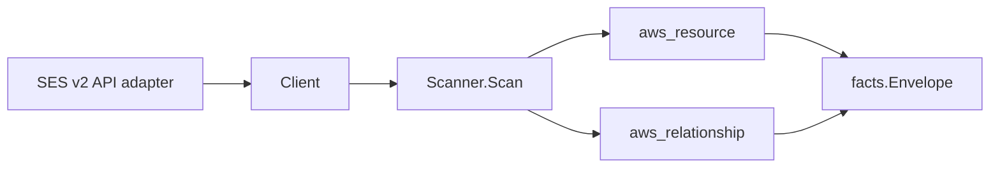

# Amazon SES Scanner

## Purpose

`internal/collector/awscloud/services/ses` owns the Amazon Simple Email Service
(SES v2) scanner contract for the AWS cloud collector. It converts SES
email-identity, configuration-set, configuration-set event-destination, and
dedicated-IP-pool metadata into `aws_resource` facts and emits relationship
evidence for an identity's default configuration set, a configuration set's
dedicated IP pool, and an event destination's SNS topic and Firehose delivery
stream targets.

## Ownership boundary

This package owns scanner-level SES fact selection and identity mapping. It does
not own AWS SDK pagination, STS credentials, workflow claims, fact persistence,
graph writes, reducer admission, or query behavior.

## Exported surface

See `doc.go` for the godoc contract.

- `Client` - minimal SES metadata read surface consumed by `Scanner`.
- `Scanner` - emits identity, configuration set, event destination, and pool
  resources plus their relationships for one boundary.
- `Snapshot`, `EmailIdentity`, `ConfigurationSet`, `EventDestination`,
  `DedicatedIPPool` - scanner-owned views with DKIM signing tokens, identity
  policy documents, and SMTP credential fields intentionally absent.

## Dependencies

- `internal/collector/awscloud` for boundaries, resource constants,
  relationship constants, partition helpers, and envelope builders.
- `internal/facts` for emitted fact envelope kinds.

The package depends on a small `Client` interface rather than the AWS SDK for
Go v2 so tests can use fake clients and the runtime adapter can own SDK
behavior.

## Telemetry

This scanner emits no spans or logs directly. `awsruntime.ClaimedSource` records
scan duration and emitted resource counts after `Scanner.Scan` returns. The
`awssdk` adapter records SES API call counts, throttles, and pagination spans.

## Gotchas / invariants

- SES facts are metadata only. The scanner must never send email, never read
  message or template bodies, and never persist DKIM private keys, DKIM signing
  tokens, identity policy documents, or SMTP credentials.
- The email-identity node publishes its resource_id as the trimmed identity name
  (the email address or domain), which is unique per account/region. The
  configuration-set node publishes its resource_id as the trimmed set name. The
  identity-to-default-configuration-set edge is keyed by the set name so it joins
  the configuration-set node.
- The dedicated-IP-pool node publishes its resource_id as the trimmed pool name.
  The configuration-set-to-dedicated-IP-pool edge is keyed by that pool name.
- The event-destination node publishes its resource_id as
  `<configuration-set>/<destination>` so destinations of the same name under
  different sets stay distinct.
- The event-destination-to-SNS-topic edge is keyed by the SNS topic ARN SES
  reports, which matches the SNS scanner's published topic resource_id. The
  event-destination-to-Firehose edge is keyed by the delivery stream ARN SES
  reports, which matches the Firehose scanner's published stream resource_id.
- The identity-DKIM-to-KMS-key edge is emitted only on the defensive path where
  AWS ever reports a customer key identifier on the DKIM attributes (SES v2 does
  not surface one today); `target_arn` is set only for ARN-shaped identifiers.
- Synthesized identity, configuration-set, and dedicated-IP-pool ARNs derive the
  partition from the scan boundary via `awscloud.PartitionForBoundary`; the
  scanner never hardcodes `arn:aws:`, so GovCloud and China resolve correctly.
- Emit reported evidence only. Do not infer deployment, workload, repository
  ownership, environment, or deployable-unit truth from identity, set, pool, or
  destination names, or AWS tags.

## Evidence

Collector Performance Evidence:
`go test ./internal/collector/awscloud/services/ses/...` covers the bounded SES
metadata path: one paginated ListEmailIdentities stream with one GetEmailIdentity
point read per identity, one paginated ListConfigurationSets stream with one
GetConfigurationSet and one GetConfigurationSetEventDestinations point read per
set, one paginated ListDedicatedIpPools stream, no send APIs, no message or
template body reads, no DKIM token reads, and no graph writes in the collector.

No-Regression Evidence: metadata-only control-plane scanner; new read path, no change to existing hot paths. `go test ./internal/collector/awscloud/services/ses/...` green.
No-Observability-Change: reuses shared AWS pagination span + API-call/throttle counters; no telemetry contract change.

Collector Deployment Evidence: SES runs inside the existing hosted
`collector-aws-cloud` runtime, so `/healthz`, `/readyz`, `/metrics`, and
`/admin/status` stay covered by the command wiring and Helm collector runtime.

## Related docs

- `docs/public/services/collector-aws-cloud.md`
- `docs/public/services/collector-aws-cloud-scanners.md`
- `docs/public/services/collector-aws-cloud-security.md`
