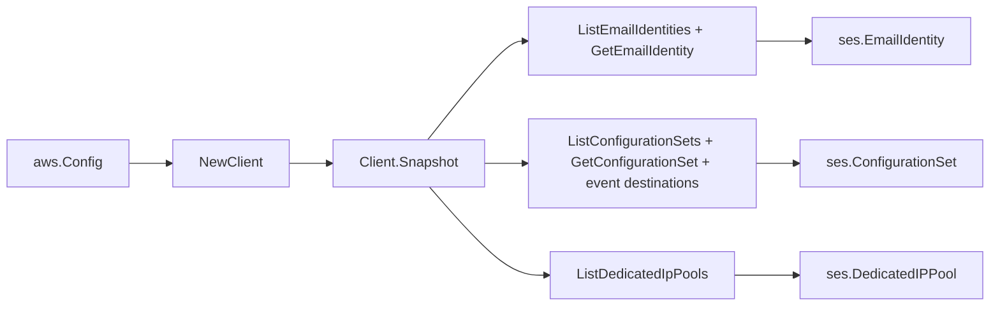

# Amazon SES SDK Adapter

## Purpose

`internal/collector/awscloud/services/ses/awssdk` adapts AWS SDK for Go v2 SES
v2 responses to the scanner-owned `Client` contract. It owns email-identity and
configuration-set listing pagination, the per-identity and per-set get fan-out,
the dedicated-IP-pool listing, throttle classification, per-call AWS API
telemetry, and the mapping of each SES response into safe identity, verification,
DKIM-enum, and resolvable-reference metadata.

## Ownership boundary

This package owns SDK calls for SES. It does not own workflow claims, credential
acquisition, SES fact selection, graph writes, reducer admission, or query
behavior.

## Exported surface

See `doc.go` for the godoc contract.

- `Client` - AWS SDK-backed implementation of `ses.Client`.
- `NewClient` - builds a `Client` for one claimed AWS boundary.

## Dependencies

- `internal/collector/awscloud` for account, region, and service boundary
  labels.
- `internal/collector/awscloud/services/ses` for scanner-owned result types.
- `internal/telemetry` for AWS API call and throttle instruments.
- AWS SDK for Go v2 `sesv2` and Smithy error contracts.

## Telemetry

SES list pages and per-resource get reads are wrapped with:

- `aws.service.pagination.page`
- `eshu_dp_aws_api_calls_total`
- `eshu_dp_aws_throttle_total`

Metric labels stay bounded to service, account, region, operation, and result.
SES identity names, ARNs, MAIL FROM domains, tags, and raw AWS error payloads
stay out of metric labels.

## Gotchas / invariants

- The adapter read surface is ListEmailIdentities, GetEmailIdentity,
  ListConfigurationSets, GetConfigurationSet,
  GetConfigurationSetEventDestinations, and ListDedicatedIpPools only. The
  `apiClient` interface omits every send, template, contact, suppression-read,
  and Create/Update/Delete/Put mutation API, so they are unreachable by
  construction. A reflective guard test pins this.
- DKIM is mapped as the enabled flag, the verification status enum, and the
  signing-attributes-origin enum only. The `DkimAttributes.Tokens` signing
  tokens, the identity policy documents in `GetEmailIdentityOutput.Policies`, and
  any signing-key material are never mapped.
- Event-destination mapping records only the join-relevant target identities
  (SNS topic ARN, Firehose delivery stream ARN plus its IAM role ARN,
  EventBridge bus ARN, Pinpoint application ARN) and the CloudWatch presence
  flag. No CloudWatch dimension payload, destination secret, HEC token, or
  access key is mapped (SES v2 does not surface them).
- GetEmailIdentity and GetConfigurationSet return tags inline, so no separate
  ListTagsForResource call is made.
- SDK adapters translate AWS records into scanner-owned types; scanner tests
  should not mock AWS SDK pagination.

No-Regression Evidence: metadata-only control-plane scanner; new read path, no change to existing hot paths. `go test ./internal/collector/awscloud/services/ses/...` green.
No-Observability-Change: reuses shared AWS pagination span + API-call/throttle counters; no telemetry contract change.

## Related docs

- `docs/public/services/collector-aws-cloud-scanners.md`
- `docs/public/services/collector-aws-cloud-security.md`
