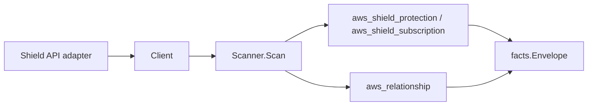

# AWS Shield Advanced Scanner

## Purpose

`internal/collector/awscloud/services/shield` owns the Shield Advanced scanner
contract for the AWS cloud collector. It converts protection metadata and the
per-account subscription summary into `aws_shield_protection` and
`aws_shield_subscription` facts and emits a protection-to-protected-resource
relationship whose target type is derived from the protected resource ARN.

Shield is a global service: one claim per account observes every protection and
the single account subscription regardless of region.

## Ownership boundary

This package owns scanner-level Shield fact selection, identity mapping, and the
protected-ARN-to-target-type classifier. It does not own AWS SDK pagination,
region pinning, STS credentials, workflow claims, fact persistence, graph
writes, reducer admission, or query behavior.

## Exported surface

See `doc.go` for the godoc contract.

- `Client` - minimal Shield metadata read surface consumed by `Scanner`.
- `Scanner` - emits protection and subscription resources plus the
  protection-to-protected-resource relationship for one boundary.
- `Protection` - scanner-owned protection view: ARN, id, name, and protected
  resource ARN only.
- `Subscription` - scanner-owned subscription view: ARN, state, and auto-renew
  flag only. Subscription limits, time commitment, and billing detail are
  intentionally outside this contract.

## Dependencies

- `internal/collector/awscloud` for boundaries, Shield resource and relationship
  constants, partition-aware ARN helpers, and envelope builders.
- `internal/facts` for emitted fact envelope kinds.

The package depends on a small `Client` interface rather than the AWS SDK for Go
v2 so tests use fake clients and the runtime adapter owns SDK behavior.

## Protected-resource target classifier (the graph-join value)

`helpers.go` classifies a protection's protected resource ARN, reported by AWS
already partition-correct, into the Eshu resource family it references and the
join key that family's scanner publishes:

| Protected ARN service | `target_type` | `target_resource_id` | ARN-keyed |
| --- | --- | --- | --- |
| `:elasticloadbalancing:` | `aws_elbv2_load_balancer` | the full load-balancer ARN | yes |
| `:cloudfront:` | `aws_cloudfront_distribution` | the full distribution ARN | yes |
| `:globalaccelerator:` | `aws_globalaccelerator_accelerator` | the full accelerator ARN | yes |
| `:eip-allocation/eipalloc-...` | `aws_vpc_elastic_ip` | the bare `eipalloc-` allocation id | no |
| `:route53:::hostedzone/Z...` | `aws_route53_hosted_zone` | the bare hosted-zone id | no |

The ELBv2, CloudFront, and Global Accelerator scanners publish their
`resource_id` as the resource ARN, so the protected ARN is used directly and the
edge carries `target_arn`. The VPC (Elastic IP) and Route 53 scanners publish a
bare id (`eipalloc-...`, `Z...`), so the classifier extracts the bare id from
the protected ARN and the edge leaves `target_arn` unset, keeping the relguard
join-mode check satisfied. A protected ARN whose service has no canonical Eshu
resource family is skipped: no untyped or dangling edge is emitted.

## Telemetry

This scanner emits no spans or logs directly. `awsruntime.ClaimedSource` records
scan duration and emitted resource counts after `Scanner.Scan` returns through
`eshu_dp_aws_resources_emitted_total{service="shield"}` and
`eshu_dp_aws_relationships_emitted_total`. The `awssdk` adapter records Shield
API call counts, throttles, and pagination spans.

## Gotchas / invariants

- Shield facts are metadata only. The scanner never reads or persists
  subscription limits, time commitment, start/end times, proactive engagement
  status, emergency contacts, or any other billing detail beyond the
  subscription state and auto-renew flag.
- Relationships are emitted only when AWS reports both the protection identity
  and a protected resource ARN that classifies to a known resource family.
- The protected resource ARN comes from the API already partition-correct and is
  used directly (or has its bare id extracted); it is never synthesized, so a
  GovCloud or China protection joins the real target node.
- One subscription exists per account. When AWS reports no subscription ARN, the
  resource id falls back to a stable per-account id.
- Do not infer environment, owner, workload, or deployable-unit truth from
  protection names. Correlation belongs in reducers.

## Evidence

Collector Performance Evidence: `go test ./internal/collector/awscloud/services/shield/...`
covers the bounded Shield metadata path: one `NextToken`-paginated
`ListProtections` stream, one `DescribeSubscription` point read with a single
`GetSubscriptionState` read for the canonical state, no per-protection detail
read, no mutations, and no graph writes in the collector.

No-Regression Evidence:
`go test ./internal/collector/awscloud/services/shield/... ./internal/collector/awscloud/internal/relguard/... ./cmd/collector-aws-cloud/... -count=1`
covers protection and subscription fact emission, the protected-ARN classifier
across ELBv2, CloudFront, Elastic IP, Route 53 hosted zone, and Global
Accelerator (each producing the correct `target_type` and `target_resource_id`),
the unrecognized-ARN skip, the missing-protected-ARN skip, the relguard
graph-join contract on every emitted edge, the SDK adapter's read-only interface
(reflection exclusion test) and metadata-only subscription mapping, runtime
registration, and the derived supported-service guard.

Collector Observability Evidence: Shield uses the existing AWS collector
`aws.service.pagination.page` span plus `eshu_dp_aws_api_calls_total`,
`eshu_dp_aws_throttle_total`, `eshu_dp_aws_resources_emitted_total`,
`eshu_dp_aws_relationships_emitted_total`, and `aws_scan_status` rows. Metric
labels stay bounded to service, account, region, operation, result, and status.

No-Observability-Change: the existing AWS collector telemetry contract already
diagnoses Shield scans through `aws.service.scan`,
`aws.service.pagination.page`, API/throttle counters, resource/relationship
counters, and `aws_scan_status`. No new instrument, span, or metric label is
added.

Collector Deployment Evidence: Shield runs inside the existing hosted
`collector-aws-cloud` runtime, so `/healthz`, `/readyz`, `/metrics`, and
`/admin/status` stay covered by the command wiring and Helm collector runtime.

## Related docs

- `docs/public/services/collector-aws-cloud-scanners.md`
- `docs/public/services/collector-aws-cloud-security.md`
- `docs/public/guides/collector-authoring.md`
