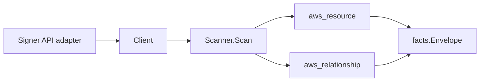

# AWS Signer Scanner

## Purpose

`internal/collector/awscloud/services/signer` owns the AWS Signer (code-signing)
scanner contract for the AWS cloud collector. It converts Signer signing-profile
and signing-platform metadata into `aws_resource` facts and emits relationship
evidence for the profile's ACM certificate dependency and the signing platform
each profile is bound to.

## Ownership boundary

This package owns scanner-level Signer fact selection and identity mapping. It
does not own AWS SDK pagination, STS credentials, workflow claims, fact
persistence, graph writes, reducer admission, or query behavior.

## Exported surface

See `doc.go` for the godoc contract.

- `Client` - minimal Signer metadata read surface consumed by `Scanner`.
- `Scanner` - emits signing-profile and signing-platform resources plus their
  relationships for one boundary.
- `Snapshot`, `SigningProfile`, `SigningPlatform` - scanner-owned views with
  signing material private keys, signed-object payloads, signing-parameter
  values, and signing-job fields intentionally absent.

## Dependencies

- `internal/collector/awscloud` for boundaries, resource constants, relationship
  constants, partition helpers, and envelope builders.
- `internal/facts` for emitted fact envelope kinds.

The package depends on a small `Client` interface rather than the AWS SDK for
Go v2 so tests can use fake clients and the runtime adapter can own SDK
behavior.

## Telemetry

This scanner emits no spans or logs directly. `awsruntime.ClaimedSource` records
scan duration and emitted resource counts after `Scanner.Scan` returns. The
`awssdk` adapter records Signer API call counts, throttles, and pagination
spans.

## Gotchas / invariants

- Signer facts are metadata only. The scanner must never start a signing job,
  read signing-material private keys, read signed-object payloads, persist
  signing-parameter values, or call any mutation/signing API. Only the signing
  parameter NAMES survive; the values are dropped because they can carry
  user-supplied data.
- The signing-profile node publishes its resource_id as the profile ARN (falling
  back to the profile name). The profile's own edges are sourced on that same
  value so they join the profile node instead of dangling.
- The signing-platform node publishes its resource_id as the bare platform id
  (for example `AWSLambda-SHA384-ECDSA`); Signer platforms carry no AWS ARN, so
  no ARN is synthesized for them.
- The profile-to-ACM-certificate edge is emitted only when AWS reports a signing
  material certificate ARN. AWS reports a certificate ARN, which matches the ACM
  scanner's published certificate resource_id; `target_arn` is set only for the
  ARN-shaped identifier and the edge is skipped for a non-ARN value (the value
  is still kept on the profile node as `certificate_arn`).
- The profile-to-signing-platform edge is an internal edge keyed by the bare
  platform id this scanner also publishes as a signing-platform resource_id, so
  it joins the platform node the scanner emits. It carries no `target_arn`
  because platforms have no ARN.
- No S3 source/destination, KMS, or Lambda code-signing-config edge is emitted:
  signing profiles do not report those dependencies (an S3 source/destination is
  reported only on a signing job, which is data-plane and never read), so those
  edges are skipped rather than dangled.
- Emit reported evidence only. Do not infer deployment, workload, repository
  ownership, environment, or deployable-unit truth from profile, platform, or
  certificate identities, or AWS tags.

## Evidence

Collector Performance Evidence:
`go test ./internal/collector/awscloud/services/signer/...` covers the bounded
Signer metadata path: one paginated ListSigningProfiles stream, one
GetSigningProfile point read per profile (image-format enrichment), one
paginated ListSigningPlatforms stream, no signing-job reads, no SignPayload, no
mutations, and no graph writes in the collector.

No-Regression Evidence: metadata-only control-plane scanner; new read path, no
change to existing hot paths. `go test ./internal/collector/awscloud/services/signer/...`
green.

No-Observability-Change: reuses shared AWS pagination span + API-call/throttle
counters; no telemetry contract change.

Collector Deployment Evidence: Signer runs inside the existing hosted
`collector-aws-cloud` runtime, so `/healthz`, `/readyz`, `/metrics`, and
`/admin/status` stay covered by the command wiring and Helm collector runtime.

## Related docs

- `docs/public/services/collector-aws-cloud.md`
- `docs/public/services/collector-aws-cloud-scanners.md`
- `docs/public/services/collector-aws-cloud-security.md`
