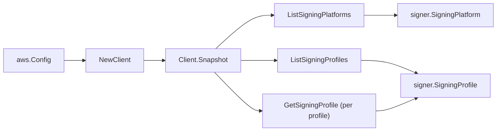

# AWS Signer SDK Adapter

## Purpose

`internal/collector/awscloud/services/signer/awssdk` adapts AWS SDK for Go v2
Signer responses to the scanner-owned `Client` contract. It owns signing-profile
pagination, per-profile metadata enrichment (image format), signing-platform
pagination, throttle classification, and per-call AWS API telemetry.

## Ownership boundary

This package owns SDK calls for Signer. It does not own workflow claims,
credential acquisition, Signer fact selection, graph writes, reducer admission,
or query behavior.

## Exported surface

See `doc.go` for the godoc contract.

- `Client` - AWS SDK-backed implementation of `signer.Client`.
- `NewClient` - builds a `Client` for one claimed AWS boundary.

## Dependencies

- `internal/collector/awscloud` for account, region, and service boundary
  labels.
- `internal/collector/awscloud/services/signer` for scanner-owned result types.
- `internal/telemetry` for AWS API call and throttle instruments.
- AWS SDK for Go v2 `signer` and Smithy error contracts.

## Telemetry

Signer paginator pages and point reads are wrapped with:

- `aws.service.pagination.page`
- `eshu_dp_aws_api_calls_total`
- `eshu_dp_aws_throttle_total`

Metric labels stay bounded to service, account, region, operation, and result.
Signer resource ARNs, names, tags, and raw AWS error payloads stay out of metric
labels.

## Gotchas / invariants

- The adapter reads metadata only. It must never call `StartSigningJob`,
  `SignPayload`, `ListSigningJobs`, `DescribeSigningJob`, `GetRevocationStatus`,
  `ListProfilePermissions`, `AddProfilePermission`, `RemoveProfilePermission`,
  `PutSigningProfile`, `CancelSigningProfile`, `RevokeSignature`,
  `RevokeSigningProfile`, `TagResource`, `UntagResource`, or any other mutation
  or signing API.
- `GetSigningProfile` is a per-profile metadata read used only to resolve the
  signing image format override (`Overrides.SigningImageFormat`) and, as a
  fallback, the signing material certificate ARN. It never reads jobs or
  payloads.
- The adapter copies only signing-parameter NAMES from `SigningParameters`; the
  values are dropped because they can carry user-supplied data.
- Only the ACM certificate ARN reference is copied from `SigningMaterial`; the
  certificate body and private key are never read.
- `ListSigningProfiles` is called with `IncludeCanceled: true` so canceled
  profiles are still observed as metadata; their status is surfaced, not hidden.
- SDK adapters translate AWS records into scanner-owned types; scanner tests
  should not mock AWS SDK pagination.

## Related docs

- `docs/public/services/collector-aws-cloud-scanners.md`
- `docs/public/services/collector-aws-cloud-security.md`
