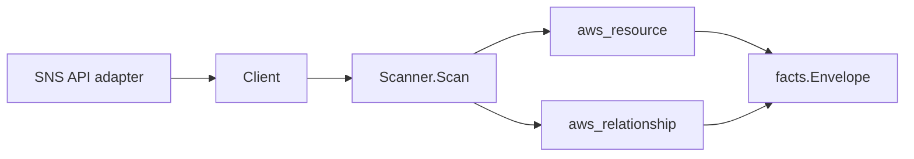

# AWS SNS Scanner

## Purpose

`internal/collector/awscloud/services/sns` owns the SNS scanner contract for the
AWS cloud collector. It converts topic metadata into `aws_resource` facts and
emits subscription relationship evidence only when AWS reports an
ARN-addressable endpoint such as SQS or Lambda.

## Ownership boundary

This package owns scanner-level SNS fact selection and identity mapping. It does
not own AWS SDK pagination, STS credentials, workflow claims, fact persistence,
graph writes, reducer admission, or query behavior.

## Exported surface

See `doc.go` for the godoc contract.

- `Client` - minimal SNS metadata read surface consumed by `Scanner`.
- `Scanner` - emits topic metadata facts for one boundary.
- `Topic` - scanner-owned SNS topic representation.
- `TopicAttributes` - safe topic metadata fields. Topic policy JSON,
  delivery-policy JSON, data-protection-policy JSON, and message payloads are
  intentionally outside the contract.
- `Subscription` - safe subscription metadata with only ARN-shaped endpoints
  retained.

## Dependencies

- `internal/collector/awscloud` for boundaries, resource constants,
  relationship constants, and envelope builders.
- `internal/facts` for emitted fact envelope kinds.

The package depends on a small `Client` interface rather than the AWS SDK for Go
v2 so tests can use fake clients and runtime adapters can own SDK behavior.

## Telemetry

This scanner emits no spans or logs directly. `awsruntime.ClaimedSource`
records scan duration and emitted resource counts after `Scanner.Scan` returns.
The `awssdk` adapter records SNS API call counts, throttles, and pagination
spans.

## Gotchas / invariants

- SNS topic facts are metadata only. The scanner must not publish, read, or
  persist message payloads.
- Topic policy JSON, delivery-policy JSON, and data-protection-policy JSON are
  not persisted because they can carry authorization or message-inspection
  configuration.
- Subscription relationships are emitted only when the source topic ARN and
  subscription endpoint ARN are both present.
- Email, SMS, HTTP, and HTTPS subscription endpoints are not persisted.
- Tags are raw AWS tag evidence. Do not infer environment, owner, workload, or
  deployable-unit truth from tags in this package.

## Evidence

Collector Performance Evidence: `go test ./internal/collector/awscloud/services/sns/...`
covers the bounded SNS metadata path: one paginated topic listing, one metadata
attribute read per topic, one tag read per topic, one paginated subscription
listing per topic, no message publishes, no subscription mutations, and no graph
writes in the collector.

No-Regression Evidence: `go test ./cmd/collector-aws-cloud ./internal/collector/awscloud/...`
covers SNS topic metadata fact emission, ARN-only subscription relationship
emission, omission of topic policy/data-protection/message payload fields,
runtime registration, command configuration, and the SDK adapter's safe
attribute mapping.

Collector Observability Evidence: SNS uses the existing AWS collector
`aws.service.pagination.page` span plus `eshu_dp_aws_api_calls_total`,
`eshu_dp_aws_throttle_total`, `eshu_dp_aws_resources_emitted_total`,
`eshu_dp_aws_relationships_emitted_total`, and `aws_scan_status` rows. Metric
labels stay bounded to service, account, region, operation, result, and status.

No-Observability-Change: the existing AWS collector telemetry contract already
diagnoses SNS scans through `aws.service.scan`, `aws.service.pagination.page`,
API/throttle counters, resource/relationship counters, and `aws_scan_status`.

Collector Deployment Evidence: SNS runs inside the existing hosted
`collector-aws-cloud` runtime, so `/healthz`, `/readyz`, `/metrics`, and
`/admin/status` stay covered by the command wiring and Helm collector runtime.

## Related docs

- `docs/docs/adrs/2026-04-20-aws-cloud-scanner-collector.md`
- `docs/docs/guides/collector-authoring.md`
