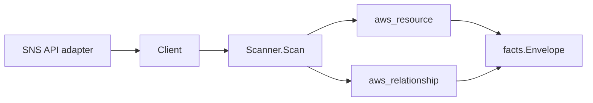

# AWS SNS Scanner

## Purpose

`internal/collector/awscloud/services/sns` owns the SNS scanner contract for the
AWS cloud collector. It converts topic metadata into `aws_resource` facts and
emits subscription relationship evidence only when AWS reports an
ARN-addressable endpoint such as SQS or Lambda.

## Ownership boundary

This package owns scanner-level SNS fact selection and identity mapping. It does
not own AWS SDK pagination, STS credentials, workflow claims, fact persistence,
graph writes, reducer admission, or query behavior.



## Exported surface

See `doc.go` for the godoc contract.

- `Client` - minimal SNS metadata read surface consumed by `Scanner`.
- `Scanner` - emits topic metadata facts for one boundary.
- `Topic` - scanner-owned SNS topic representation.
- `TopicAttributes` - safe topic metadata fields. Topic policy JSON,
  delivery-policy JSON, data-protection-policy JSON, and message payloads are
  intentionally outside the contract.
- `Subscription` - safe subscription metadata with only ARN-shaped endpoints
  retained.

## Dependencies

- `internal/collector/awscloud` for boundaries, resource constants,
  relationship constants, and envelope builders.
- `internal/facts` for emitted fact envelope kinds.

The package depends on a small `Client` interface rather than the AWS SDK for Go
v2 so tests can use fake clients and runtime adapters can own SDK behavior.

## Telemetry

This scanner emits no spans or logs directly. `awsruntime.ClaimedSource`
records scan duration and emitted resource counts after `Scanner.Scan` returns.
The `awssdk` adapter records SNS API call counts, throttles, and pagination
spans.

## Gotchas / invariants

- SNS topic facts are metadata only. The scanner must not publish, read, or
  persist message payloads.
- Topic policy JSON, delivery-policy JSON, and data-protection-policy JSON are
  not persisted because they can carry authorization or message-inspection
  configuration.
- Subscription relationships are emitted only when the source topic ARN and
  subscription endpoint ARN are both present.
- Email, SMS, HTTP, and HTTPS subscription endpoints are not persisted.
- Tags are raw AWS tag evidence. Do not infer environment, owner, workload, or
  deployable-unit truth from tags in this package.

## Verification

```bash
go test ./internal/collector/awscloud/services/sns/... -count=1
go test ./cmd/collector-aws-cloud ./internal/collector/awscloud/... -count=1
go run ./cmd/eshu docs verify ../go/internal/collector/awscloud/services/sns --limit 1000 \
  --fail-on contradicted,missing_evidence
```

Run the AWS runtime tests when scan warnings or partial-status behavior changes.

## Related docs

- `docs/public/services/collector-aws-cloud.md`
- `docs/public/guides/collector-authoring.md`
