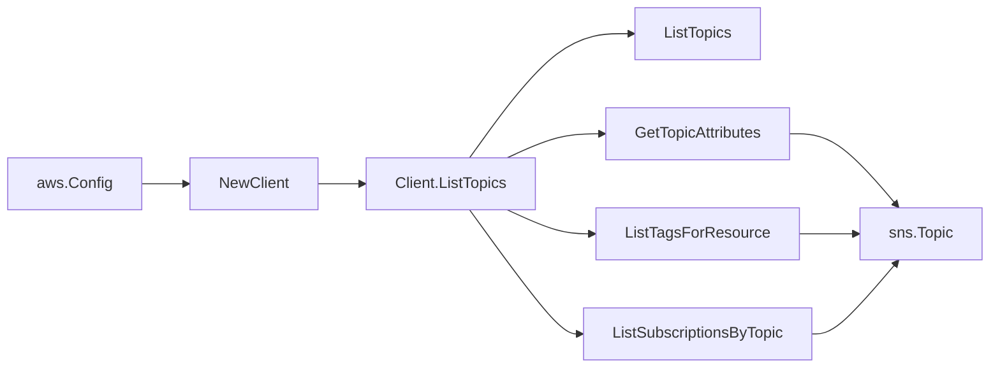

# AWS SNS SDK Adapter

## Purpose

`internal/collector/awscloud/services/sns/awssdk` adapts AWS SDK for Go v2 SNS
responses to the scanner-owned `sns.Client` contract. It owns SNS topic
pagination, topic metadata reads, topic tag reads, subscription pagination,
throttle classification, and per-call AWS API telemetry.

## Ownership boundary

This package owns SDK calls for SNS. It does not own workflow claims,
credential acquisition, SNS fact selection, graph writes, reducer admission, or
query behavior.

## Exported surface

See `doc.go` for the godoc contract.

- `Client` - AWS SDK-backed implementation of `sns.Client`.
- `NewClient` - builds a `Client` for one claimed AWS boundary.

## Dependencies

- `internal/collector/awscloud` for account, region, and service boundary
  labels.
- `internal/collector/awscloud/services/sns` for scanner-owned result types.
- `internal/telemetry` for AWS API call and throttle instruments.
- AWS SDK for Go v2 `sns` and Smithy error contracts.

## Telemetry

SNS paginator pages and point reads are wrapped with:

- `aws.service.pagination.page`
- `eshu_dp_aws_api_calls_total`
- `eshu_dp_aws_throttle_total`

Metric labels stay bounded to service, account, region, operation, and result.
Topic ARNs, tags, subscription ARNs, endpoints, policies, and raw AWS error
payloads stay out of metric labels.

## Gotchas / invariants

- ListTopics discovers topic ARNs. GetTopicAttributes is mapped through a safe
  allowlist and must not persist `Policy`, `DeliveryPolicy`,
  `EffectiveDeliveryPolicy`, or `DataProtectionPolicy`.
- ListTagsForResource reads topic tags as raw evidence.
- ListSubscriptionsByTopic keeps only ARN-shaped endpoints for relationship
  evidence. Email, SMS, HTTP, and HTTPS endpoints are omitted.
- The adapter must not call Publish, Subscribe, Unsubscribe, SetTopicAttributes,
  PutDataProtectionPolicy, or any other mutation/message-content API.
- SDK adapters translate AWS records into scanner-owned types; scanner tests
  should not mock AWS SDK paginators.

## Related docs

- `docs/docs/adrs/2026-04-20-aws-cloud-scanner-collector.md`
- `docs/docs/guides/collector-authoring.md`
