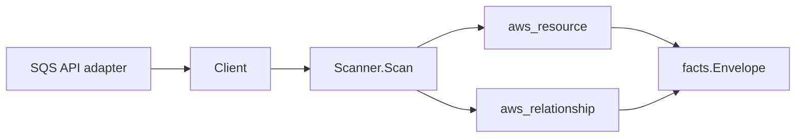

# AWS SQS Scanner

## Purpose

`internal/collector/awscloud/services/sqs` owns the SQS scanner contract for the
AWS cloud collector. It converts queue metadata into `aws_resource` facts and
emits optional dead-letter queue relationship evidence from safe redrive
attributes.

## Ownership boundary

This package owns scanner-level SQS fact selection and identity mapping. It does
not own AWS SDK pagination, STS credentials, workflow claims, fact persistence,
graph writes, reducer admission, or query behavior.



## Exported surface

See `doc.go` for the godoc contract.

- `Client` - minimal SQS metadata read surface consumed by `Scanner`.
- `Scanner` - emits queue metadata facts for one boundary.
- `Queue` - scanner-owned SQS queue representation.
- `QueueAttributes` - safe queue metadata fields. Message bodies and queue
  policy JSON are intentionally outside the contract.

## Dependencies

- `internal/collector/awscloud` for boundaries, resource constants,
  relationship constants, and envelope builders.
- `internal/facts` for emitted fact envelope kinds.

The package depends on a small `Client` interface rather than the AWS SDK for Go
v2 so tests can use fake clients and runtime adapters can own SDK behavior.

## Telemetry

This scanner emits no spans or logs directly. `awsruntime.ClaimedSource`
records scan duration and emitted resource counts after `Scanner.Scan` returns.
The `awssdk` adapter records SQS API call counts, throttles, and pagination
spans.

## Gotchas / invariants

- SQS queue facts are metadata only. The scanner must not read messages or
  persist message bodies.
- Queue policy JSON is not persisted because it is authorization policy data,
  not inventory metadata.
- Dead-letter queue relationships are emitted only when the source queue ARN
  and `deadLetterTargetArn` are both present.
- Tags are raw AWS tag evidence. Do not infer environment, owner, workload, or
  deployable-unit truth from tags in this package.

## Verification

```bash
go test ./internal/collector/awscloud/services/sqs/... -count=1
go test ./cmd/collector-aws-cloud ./internal/collector/awscloud/... -count=1
go run ./cmd/eshu docs verify ../go/internal/collector/awscloud/services/sqs --limit 1000 \
  --fail-on contradicted,missing_evidence
```

Run the AWS runtime tests when scan warnings or partial-status behavior changes.

## Related docs

- `docs/public/services/collector-aws-cloud.md`
- `docs/public/guides/collector-authoring.md`
