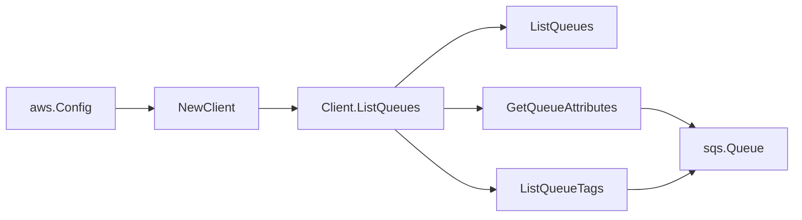

# AWS SQS SDK Adapter

## Purpose

`internal/collector/awscloud/services/sqs/awssdk` adapts AWS SDK for Go v2 SQS
responses to the scanner-owned `sqs.Client` contract. It owns SQS queue
pagination, queue metadata reads, queue tag reads, throttle classification, and
per-call AWS API telemetry.

## Ownership boundary

This package owns SDK calls for SQS. It does not own workflow claims,
credential acquisition, SQS fact selection, graph writes, reducer admission, or
query behavior.

## Exported surface

See `doc.go` for the godoc contract.

- `Client` - AWS SDK-backed implementation of `sqs.Client`.
- `NewClient` - builds a `Client` for one claimed AWS boundary.

## Dependencies

- `internal/collector/awscloud` for account, region, and service boundary
  labels.
- `internal/collector/awscloud/services/sqs` for scanner-owned result types.
- `internal/telemetry` for AWS API call and throttle instruments.
- AWS SDK for Go v2 `sqs` and Smithy error contracts.

## Telemetry

SQS paginator pages and point reads are wrapped with:

- `aws.service.pagination.page`
- `eshu_dp_aws_api_calls_total`
- `eshu_dp_aws_throttle_total`

Metric labels stay bounded to service, account, region, operation, and result.
Queue URLs, queue ARNs, tags, redrive policy values, and raw AWS error payloads
stay out of metric labels.

## Gotchas / invariants

- ListQueues discovers queue URLs. GetQueueAttributes requests an explicit
  metadata allowlist and must not request `Policy`.
- ListQueueTags reads queue tags as raw evidence.
- The adapter must not call ReceiveMessage, DeleteMessage, PurgeQueue, or any
  other data-plane mutation/read of message contents.
- RedrivePolicy and RedriveAllowPolicy are parsed into bounded metadata
  fields; raw JSON is not persisted.
- SDK adapters translate AWS records into scanner-owned types; scanner tests
  should not mock AWS SDK paginators.

## Related docs

- `docs/docs/adrs/2026-04-20-aws-cloud-scanner-collector.md`
- `docs/docs/guides/collector-authoring.md`
