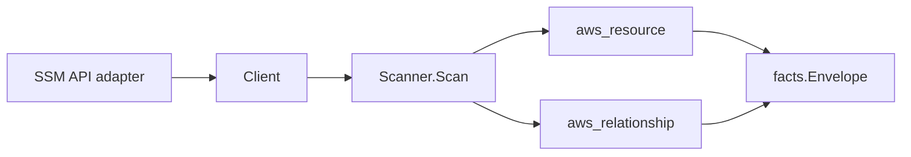

# AWS SSM Parameter Store Scanner

## Purpose

`internal/collector/awscloud/services/ssm` owns the AWS Systems Manager
Parameter Store scanner contract for the AWS cloud collector. It converts
parameter control-plane metadata into `aws_resource` facts and emits
relationship evidence when AWS directly reports a KMS key dependency.

## Ownership boundary

This package owns scanner-level SSM Parameter Store fact selection and identity
mapping. It does not own AWS SDK pagination, STS credentials, workflow claims,
fact persistence, graph writes, reducer admission, workload ownership, or query
behavior.



## Exported surface

See `doc.go` for the godoc contract.

- `Client` - minimal SSM Parameter Store metadata read surface consumed by
  `Scanner`.
- `Scanner` - emits parameter metadata and direct KMS relationship facts for
  one boundary.
- `Parameter` - scanner-owned metadata-only parameter representation.
- `PolicyMetadata` - safe policy shape with type and status only.

## Dependencies

- `internal/collector/awscloud` for boundaries, resource constants,
  relationship constants, and envelope builders.
- `internal/facts` for emitted fact envelope kinds.

The package depends on a small `Client` interface rather than the AWS SDK for Go
v2 so tests can use fake clients and runtime adapters can own SDK behavior.

## Telemetry

This scanner emits no spans or logs directly. `awsruntime.ClaimedSource`
records scan duration and emitted resource counts after `Scanner.Scan` returns.
The `awssdk` adapter records SSM API call counts, throttles, and pagination
spans.

## Gotchas / invariants

- SSM facts are metadata only. The scanner must not read parameter values,
  history values, raw descriptions, raw allowed patterns, raw policy JSON, or
  mutate SSM resources.
- Parameter identity, type, tier, data type, KMS key identifier, timestamp,
  description presence, allowed-pattern presence, safe policy type/status
  metadata, and tags are reported control-plane metadata.
- Tags are raw AWS tag evidence. Do not infer environment, owner, workload,
  repository, or deployable-unit truth from tags in this package.
- KMS relationships are reported join evidence only. Correlation belongs in
  reducers.

## Verification

```bash
go test ./internal/collector/awscloud/services/ssm/... -count=1
go test ./cmd/collector-aws-cloud ./internal/collector/awscloud/... -count=1
go run ./cmd/eshu docs verify ../go/internal/collector/awscloud/services/ssm --limit 1000 \
  --fail-on contradicted,missing_evidence
```

Run the AWS runtime tests when scan warnings or partial-status behavior changes.

## Related docs

- `docs/public/services/collector-aws-cloud.md`
- `docs/public/guides/collector-authoring.md`
