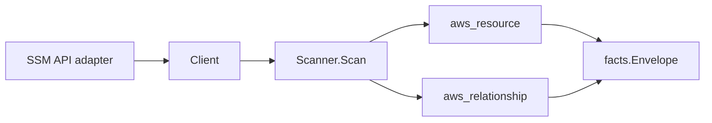

# AWS SSM Parameter Store Scanner

## Purpose

`internal/collector/awscloud/services/ssm` owns the AWS Systems Manager
Parameter Store scanner contract for the AWS cloud collector. It converts
parameter control-plane metadata into `aws_resource` facts and emits
relationship evidence when AWS directly reports a KMS key dependency.

## Ownership boundary

This package owns scanner-level SSM Parameter Store fact selection and identity
mapping. It does not own AWS SDK pagination, STS credentials, workflow claims,
fact persistence, graph writes, reducer admission, workload ownership, or query
behavior.

## Exported surface

See `doc.go` for the godoc contract.

- `Client` - minimal SSM Parameter Store metadata read surface consumed by
  `Scanner`.
- `Scanner` - emits parameter metadata and direct KMS relationship facts for
  one boundary.
- `Parameter` - scanner-owned metadata-only parameter representation.
- `PolicyMetadata` - safe policy shape with type and status only.

## Dependencies

- `internal/collector/awscloud` for boundaries, resource constants,
  relationship constants, and envelope builders.
- `internal/facts` for emitted fact envelope kinds.

The package depends on a small `Client` interface rather than the AWS SDK for Go
v2 so tests can use fake clients and runtime adapters can own SDK behavior.

## Telemetry

This scanner emits no spans or logs directly. `awsruntime.ClaimedSource`
records scan duration and emitted resource counts after `Scanner.Scan` returns.
The `awssdk` adapter records SSM API call counts, throttles, and pagination
spans.

## Gotchas / invariants

- SSM facts are metadata only. The scanner must not read parameter values,
  history values, raw descriptions, raw allowed patterns, raw policy JSON, or
  mutate SSM resources.
- Parameter identity, type, tier, data type, KMS key identifier, timestamp,
  description presence, allowed-pattern presence, safe policy type/status
  metadata, and tags are reported control-plane metadata.
- Tags are raw AWS tag evidence. Do not infer environment, owner, workload,
  repository, or deployable-unit truth from tags in this package.
- KMS relationships are reported join evidence only. Correlation belongs in
  reducers.

## Evidence

Collector Performance Evidence: `go test ./internal/collector/awscloud/services/ssm/...`
covers the bounded SSM Parameter Store metadata path: paginated
DescribeParameters with MaxResults=50 and one ListTagsForResource read per
parameter name. The collector does not call GetParameter, GetParameters,
GetParametersByPath, GetParameterHistory, decryption, mutation APIs, or graph
writes.

No-Regression Evidence: `go test ./cmd/collector-aws-cloud ./internal/collector/awscloud/...`
covers SSM parameter metadata fact emission, direct KMS relationship emission,
omission of values/history/descriptions/allowed-patterns/policy JSON, SDK
pagination, tag reads, runtime registration, command configuration, and the SDK
adapter's safe metadata mapping.

Collector Observability Evidence: SSM uses the existing AWS collector
`aws.service.pagination.page` span plus `eshu_dp_aws_api_calls_total`,
`eshu_dp_aws_throttle_total`, `eshu_dp_aws_resources_emitted_total`,
`eshu_dp_aws_relationships_emitted_total`, and `aws_scan_status` rows. Metric
labels stay bounded to service, account, region, operation, result, and status.

No-Observability-Change: the existing AWS collector telemetry contract already
diagnoses SSM scans through `aws.service.scan`,
`aws.service.pagination.page`, API/throttle counters, resource/relationship
counters, and `aws_scan_status`.

Collector Deployment Evidence: SSM runs inside the existing hosted
`collector-aws-cloud` runtime, so `/healthz`, `/readyz`, `/metrics`, and
`/admin/status` stay covered by the command wiring and Helm collector runtime.

## Related docs

- `docs/docs/adrs/2026-04-20-aws-cloud-scanner-collector.md`
- `docs/docs/guides/collector-authoring.md`
