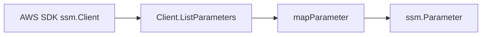

# SSM AWS SDK Adapter

## Purpose

`internal/collector/awscloud/services/ssm/awssdk` adapts AWS SDK for Go v2 SSM
control-plane responses into the scanner-owned metadata model used by
`internal/collector/awscloud/services/ssm`.

## Ownership boundary

This package owns SSM SDK pagination, tag reads, API-call telemetry, Smithy
throttle classification, and safe response mapping. It does not own workflow
claims, credential loading, fact-envelope construction, graph writes, reducer
admission, or query behavior.

## Exported surface

See `doc.go` for the godoc contract.

- `Client` - AWS SDK-backed implementation of `ssm.Client`.
- `NewClient` - builds a `Client` for one claimed AWS boundary.

## Dependencies

- `internal/collector/awscloud` for boundary identity and API-call status
  recording.
- `internal/collector/awscloud/services/ssm` for scanner-owned metadata types.
- `internal/telemetry` for AWS collector spans and metric attributes.
- AWS SDK for Go v2 `ssm` and Smithy error contracts.

## Telemetry

`Client.ListParameters` wraps DescribeParameters pages and ListTagsForResource
point reads in `aws.service.pagination.page`, records
`eshu_dp_aws_api_calls_total`, and records `eshu_dp_aws_throttle_total` when
Smithy error codes indicate throttling. Metric labels stay bounded to service,
account, region, operation, and result.

## Gotchas / invariants

- The adapter calls DescribeParameters with `MaxResults=50`.
- The adapter calls ListTagsForResource with resource type `Parameter` and the
  parameter name returned by DescribeParameters.
- The adapter must not expose GetParameter, GetParameters,
  GetParametersByPath, GetParameterHistory, decryption, or mutation APIs
  through its internal client interface.
- Raw descriptions and allowed patterns are reduced to presence flags. Policy
  JSON text, parameter values, and history values stay out of scanner-owned
  structs.
- Tags are returned as source evidence only. Do not use them as metric labels.

## Related docs

- `../README.md`
- `docs/docs/adrs/2026-04-20-aws-cloud-scanner-collector.md`
