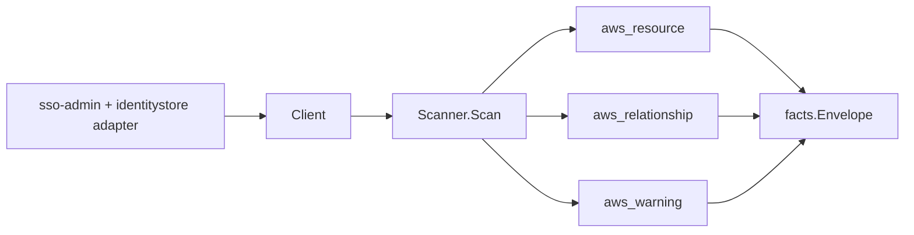

# AWS IAM Identity Center Scanner

## Purpose

`internal/collector/awscloud/services/ssoadmin` owns the AWS IAM Identity
Center (formerly AWS SSO) scanner contract for the AWS cloud collector. It
converts Identity Center instance, permission set, account assignment,
application instance, trusted token issuer, and resolved principal metadata into
`aws_resource`, `aws_relationship`, and `aws_warning` facts. Identity Center is
org-scoped and pairs with the Organizations scanner.

## Ownership boundary

This package owns scanner-level Identity Center fact selection, principal
display-name redaction, and identity mapping. It does not own AWS SDK
pagination, STS credentials, workflow claims, fact persistence, graph writes,
reducer admission, or query behavior.

## Exported surface

See `doc.go` for the godoc contract.

- `Client` - minimal Identity Center metadata read surface consumed by
  `Scanner`, exposing only `Snapshot`.
- `Scanner` - emits Identity Center metadata facts and redacts principal display
  names through `awscloud.RedactString`. Requires a non-zero redaction key.
- `Snapshot` - one metadata-only Identity Center view for a claimed account.
- `Instance`, `PermissionSet`, `AccountAssignment`, `Application`,
  `TrustedTokenIssuer`, `Principal`, `ManagedPolicyReference`, and
  `CustomerManagedPolicyReference` - scanner-owned representations that keep
  inline policy bodies and access-scope filters out of the scanner contract.

## Dependencies

- `internal/collector/awscloud` for boundaries, resource constants,
  relationship constants, warning constants, redaction helper, and envelope
  builders.
- `internal/facts` for emitted fact envelope kinds.
- `internal/redact` for deployment-keyed principal display-name markers.

The package depends on a small `Client` interface rather than the AWS SDK for Go
v2 so tests can use fake clients and runtime adapters can own SDK behavior.

## Telemetry

This scanner emits no spans or logs directly. `awsruntime.ClaimedSource`
records scan duration, emitted resource counts, and relationship counts after
`Scanner.Scan` returns. The `awssdk` adapter records sso-admin and
identitystore API call counts, throttles, and pagination spans.

## Gotchas / invariants

- Identity Center facts are metadata only. Do not add CreatePermissionSet,
  DeletePermissionSet, UpdatePermissionSet, Put/Delete
  InlinePolicyToPermissionSet, Put/Delete PermissionsBoundaryToPermissionSet,
  Attach/Detach ManagedPolicyToPermissionSet, Attach/Detach
  CustomerManagedPolicyReferenceToPermissionSet, CreateAccountAssignment,
  DeleteAccountAssignment, Create/Update/Delete Application, or
  ProvisionPermissionSet.
- NEVER read or persist permission set inline policy bodies
  (`GetInlinePolicyForPermissionSet`) or permissions boundary bodies
  (`GetPermissionsBoundaryForPermissionSet`). They encode the org
  least-privilege model and live in IAM.
- Customer-managed policy attachments are referenced by name and path only. The
  IAM policy body is never read; it lives in the IAM scanner.
- AWS managed policies are referenced by ARN. ARN references are safe inventory
  evidence; bodies stay in IAM.
- NEVER persist application access-scope attributes
  (`GetApplicationAccessScope`, `ListApplicationAccessScopes`); they can carry
  sensitive group filters.
- Principal display names must be redacted before persistence. The scanner reads
  only the identity store `DisplayName`; addresses, emails, phone numbers,
  birthdate, structured name, and memberships are never read.
- Identity Center runs require management-account or delegated-administrator
  credentials and the `us-east-1` control-plane region. Accounts with no
  Identity Center instance or without org access emit an `aws_warning` and
  leave resource facts absent for that claim.
- Tags are raw AWS tag evidence. Do not infer environment, owner, workload, or
  deployable-unit truth from tags in this package.

## Evidence

Collector Performance Evidence: `go test ./internal/collector/awscloud/services/ssoadmin/... -count=1 -race`
passed on 2026-05-28 against `origin/main` commit `b8ecec00`. The fixture input
is one in-memory Identity Center snapshot with one instance, one permission set
with managed and customer-managed policy references, one account assignment, one
application, one trusted token issuer, and one resolved group principal; it has
no Postgres queue rows and no graph backend. The scanner emits in-memory fact
envelopes only, so there is no added graph write, worker claim fanout, lease
contention, or reducer queue pressure in this package.

No-Regression Evidence: `go test ./cmd/collector-aws-cloud ./internal/collector/awscloud/...`
covers Identity Center metadata fact emission, inline-policy-body exclusion,
application access-scope exclusion, principal display-name redaction,
no-instance and access-skip warning behavior, runtime registration, command
configuration, and the SDK adapter's metadata-only API surface.

Collector Observability Evidence: Identity Center uses the existing AWS
collector `aws.service.scan` and `aws.service.pagination.page` spans plus
`eshu_dp_aws_api_calls_total`, `eshu_dp_aws_throttle_total`,
`eshu_dp_aws_resources_emitted_total{service="ssoadmin"}`,
`eshu_dp_aws_relationships_emitted_total`, and `aws_scan_status` rows to show
successful metadata emission, AWS API/throttle volume, and skipped credentials.
Metric labels stay bounded to service, account, region, operation, and result.

No-Observability-Change: the existing AWS collector telemetry contract already
covers this scanner. No new metric, span, or log name is introduced.

Collector Deployment Evidence: Identity Center runs inside the existing hosted
`collector-aws-cloud` runtime, so `/healthz`, `/readyz`, `/metrics`, and
`/admin/status` stay covered by the command wiring and Helm collector runtime.

## Related docs

- `docs/public/services/collector-aws-cloud.md`
- `docs/public/services/collector-aws-cloud-scanners.md`
- `docs/public/services/collector-aws-cloud-security.md`
- `docs/public/guides/collector-authoring.md`
