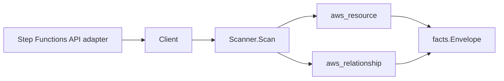

# AWS Step Functions Scanner

## Purpose

`internal/collector/awscloud/services/stepfunctions` owns the Step Functions
scanner contract for the AWS cloud collector. It converts state machine and
activity metadata into `aws_resource` facts and emits relationship evidence
for execution-role dependencies and ARN-addressable Task target references
drawn from the state machine definition.

## Ownership boundary

This package owns scanner-level Step Functions fact selection and identity
mapping. It does not own AWS SDK pagination, STS credentials, workflow claims,
fact persistence, graph writes, reducer admission, or query behavior.

## Exported surface

See `doc.go` for the godoc contract.

- `Client` - minimal Step Functions metadata read surface consumed by
  `Scanner`.
- `Scanner` - emits state machine, activity, role, and referenced-resource
  relationship facts for one boundary.
- `StateMachine` - scanner-owned state machine representation with a
  metadata-only state graph projection.
- `StateNode` - safe per-state shape with name, type, transition edges, and
  Task Resource ARN only.
- `Activity` - scanner-owned activity representation.

## Dependencies

- `internal/collector/awscloud` for boundaries, resource constants,
  relationship constants, and envelope builders.
- `internal/facts` for emitted fact envelope kinds.

The package depends on a small `Client` interface rather than the AWS SDK for
Go v2 so tests can use fake clients and runtime adapters can own SDK behavior.

## Telemetry

This scanner emits no spans or logs directly. `awsruntime.ClaimedSource`
records scan duration and emitted resource counts after `Scanner.Scan`
returns, including `eshu_dp_aws_resources_emitted_total{service="stepfunctions"}`
for the new state machine and activity resource types. The `awssdk` adapter
records Step Functions API call counts, throttles, and pagination spans.

## Gotchas / invariants

- Step Functions facts are metadata only. The scanner must not call
  StartExecution, StopExecution, CreateStateMachine, UpdateStateMachine,
  DeleteStateMachine, SendTaskSuccess, SendTaskFailure, or any other mutation
  or execution-payload API.
- Execution input, execution output, execution history events, and activity
  task tokens must never be persisted.
- The state machine definition surface is restricted to state names, state
  types, structural transitions (Next, End, Default, choice and catch Next),
  and Task Resource ARNs. Parameters, ResultPath, ResultSelector, InputPath,
  OutputPath, Result, Cause, Error literal values, and the raw definition
  string must never be persisted.
- Referenced-resource relationships are emitted only when the Task Resource is
  an ARN. Service-integration string identifiers such as
  `states:::lambda:invoke.waitForTaskToken` are not persisted as relationships.
- Tags are raw AWS tag evidence. Do not infer environment, owner, workload, or
  deployable-unit truth from tags in this package.

## Evidence

Collector Performance Evidence: `go test ./internal/collector/awscloud/services/stepfunctions/...`
covers the bounded Step Functions metadata path: one paginated
ListStateMachines stream, one DescribeStateMachine read per state machine, one
ListTagsForResource read per state machine, one paginated ListActivities
stream, one ListTagsForResource read per activity, no execution or mutation
calls, and no graph writes in the collector.

No-Regression Evidence: `go test ./cmd/collector-aws-cloud ./internal/collector/awscloud/...`
covers Step Functions state machine and activity metadata fact emission,
state-machine-to-IAM-role relationship emission, ARN-only referenced-resource
relationship emission, omission of execution input/output, omission of
literal Parameters/ResultPath/ResultSelector/InputPath/OutputPath/Result
contents, runtime registration, command configuration, and the SDK adapter's
safe metadata mapping.

Collector Observability Evidence: Step Functions uses the existing AWS
collector `aws.service.pagination.page` span plus
`eshu_dp_aws_api_calls_total`, `eshu_dp_aws_throttle_total`,
`eshu_dp_aws_resources_emitted_total{service="stepfunctions"}`,
`eshu_dp_aws_relationships_emitted_total`, and `aws_scan_status` rows. Metric
labels stay bounded to service, account, region, operation, result, and
status.

No-Observability-Change: the existing AWS collector telemetry contract
already diagnoses Step Functions scans through `aws.service.scan`,
`aws.service.pagination.page`, API/throttle counters,
resource/relationship counters, and `aws_scan_status`.

Collector Deployment Evidence: Step Functions runs inside the existing hosted
`collector-aws-cloud` runtime, so `/healthz`, `/readyz`, `/metrics`, and
`/admin/status` stay covered by the command wiring and Helm collector runtime.

## Related docs

- `docs/public/services/collector-aws-cloud.md`
- `docs/public/services/collector-aws-cloud-scanners.md`
- `docs/public/guides/collector-authoring.md`
