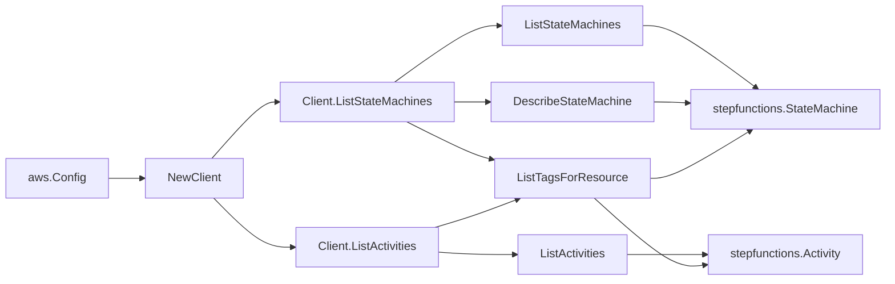

# AWS Step Functions SDK Adapter

## Purpose

`internal/collector/awscloud/services/stepfunctions/awssdk` adapts AWS SDK for
Go v2 Step Functions responses to the scanner-owned `Client` contract. It
owns state machine pagination, state machine description, activity
pagination, tag reads (for both state machines and activities),
definition-document projection, throttle classification, and per-call AWS
API telemetry. Activities use the `ListActivities` listing plus
`ListTagsForResource`; the adapter intentionally does not call
`DescribeActivity` because the listing already carries all safe activity
metadata.

## Ownership boundary

This package owns SDK calls for Step Functions. It does not own workflow
claims, credential acquisition, Step Functions fact selection, graph writes,
reducer admission, or query behavior.

## Exported surface

See `doc.go` for the godoc contract.

- `Client` - AWS SDK-backed implementation of `stepfunctions.Client`.
- `NewClient` - builds a `Client` for one claimed AWS boundary.

## Dependencies

- `internal/collector/awscloud` for account, region, and service boundary
  labels.
- `internal/collector/awscloud/services/stepfunctions` for scanner-owned
  result types.
- `internal/telemetry` for AWS API call and throttle instruments.
- AWS SDK for Go v2 `sfn` and Smithy error contracts.

## Telemetry

Step Functions paginator pages and point reads are wrapped with:

- `aws.service.pagination.page`
- `eshu_dp_aws_api_calls_total`
- `eshu_dp_aws_throttle_total`

Metric labels stay bounded to service, account, region, operation, and
result. State machine ARNs, activity ARNs, role ARNs, tags, raw definition
documents, and AWS error payloads stay out of metric labels.

## Gotchas / invariants

- ListStateMachines discovers state machines; DescribeStateMachine adds
  type, status, role, logging level, tracing flag, and the definition
  document.
- The adapter parses the definition document only to project state names,
  state types, structural transitions (Next, End, Default, choice and catch
  Next), and Task Resource ARNs. Parameters, ResultPath, ResultSelector,
  InputPath, OutputPath, Result, Cause, Error literal values, and the raw
  definition string are never returned to the scanner.
- Malformed definitions are tolerated: parsing returns whatever shape it can
  extract so one bad definition does not fail the whole scan.
- ListTagsForResource reads state machine and activity tags as raw
  evidence.
- ListActivities discovers activities; the adapter intentionally does not
  call GetActivityTask, SendTaskSuccess, SendTaskFailure, or any other
  task-payload API.
- The adapter must not call StartExecution, StopExecution,
  CreateStateMachine, UpdateStateMachine, DeleteStateMachine,
  PublishStateMachineVersion, alias mutation APIs, or
  ValidateStateMachineDefinition with side effects.
- SDK adapters translate AWS records into scanner-owned types; scanner tests
  should not mock AWS SDK pagination.

## Related docs

- `docs/public/services/collector-aws-cloud.md`
- `docs/public/services/collector-aws-cloud-scanners.md`
- `docs/public/guides/collector-authoring.md`
