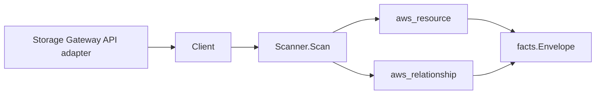

# AWS Storage Gateway Scanner

## Purpose

`internal/collector/awscloud/services/storagegateway` owns the Storage Gateway
scanner contract for the AWS cloud collector. It converts gateway metadata,
cached/stored iSCSI volume metadata, and NFS/SMB S3 file-share metadata into
`aws_resource` facts and emits relationship evidence for volume-to-gateway,
file-share-to-gateway, file-share-to-S3-bucket, file-share-to-IAM-role,
file-share-to-KMS-key, file-share-to-CloudWatch-log-group, and
gateway-to-VPC-endpoint dependencies.

## Ownership boundary

This package owns scanner-level Storage Gateway fact selection and identity
mapping. It does not own AWS SDK pagination, STS credentials, workflow claims,
fact persistence, graph writes, reducer admission, or query behavior.

## Exported surface

See `doc.go` for the godoc contract.

- `Client` - minimal Storage Gateway metadata read surface consumed by
  `Scanner`.
- `Scanner` - emits gateway, volume, and file-share resources plus their
  relationships for one boundary.
- `Gateway`, `Volume`, `FileShare` - scanner-owned views that carry safe
  identity, type, state, and dependency ARNs while leaving object contents,
  client allow lists, and admin/user lists out of the contract.

## Dependencies

- `internal/collector/awscloud` for boundaries, resource constants,
  relationship constants, partition helpers, and envelope builders.
- `internal/facts` for emitted fact envelope kinds.

The package depends on a small `Client` interface rather than the AWS SDK for
Go v2 so tests can use fake clients and runtime adapters can own SDK behavior.

## Telemetry

This scanner emits no spans or logs directly. `awsruntime.ClaimedSource`
records scan duration and emitted resource counts after `Scanner.Scan` returns.
The `awssdk` adapter records Storage Gateway API call counts, throttles, and
pagination spans.

## Gotchas / invariants

- Storage Gateway facts are metadata only. The scanner must not activate,
  delete, shut down, or reboot a gateway, must not refresh a file-share cache,
  and must not create or delete volumes or shares.
- File-share object contents, NFS client allow lists, and SMB admin/user lists
  stay outside the contract; the SDK adapter never propagates them.
- The gateway node publishes its ARN as `resource_id`. Volume-to-gateway and
  file-share-to-gateway edges key the gateway by that same ARN so the join
  resolves instead of dangling.
- File-share-to-S3-bucket edges reduce the reported `LocationARN` to the
  bucket-only, partition-aware ARN the S3 scanner publishes
  (`arn:<partition>:s3:::<bucket>`), inheriting the partition from the source
  ARN. S3 access-point `LocationARN`s are not bucket ARNs and are skipped so the
  edge never dangles.
- File-share-to-IAM-role, file-share-to-KMS-key, and
  file-share-to-CloudWatch-log-group edges are emitted only when AWS reports an
  ARN-shaped identity. The KMS edge keys the target by ARN, matching how the EFS
  and FSx scanners reference KMS keys and the ARN the KMS node carries as a
  correlation anchor.
- Gateway-to-VPC-endpoint edges are emitted only when
  `DescribeGatewayInformation` reports the VPC endpoint as the bare `vpce-` ID
  the VPC scanner publishes as its `resource_id`. DNS-hostname or IP forms cannot
  join that node and are dropped to a resource attribute instead of dangling an
  edge.

## Evidence

Collector Performance Evidence:
`go test ./internal/collector/awscloud/services/storagegateway/...` covers the
bounded Storage Gateway metadata path: one paginated ListGateways stream with
one DescribeGatewayInformation point read per gateway, one paginated ListVolumes
stream per gateway, one paginated ListFileShares stream with batched
DescribeNFSFileShares / DescribeSMBFileShares point reads, no ActivateGateway,
DeleteGateway, RefreshCache, or Create*/Delete* calls, no mutations, and no
graph writes in the collector.

No-Regression Evidence:
`go test ./cmd/collector-aws-cloud ./internal/collector/awscloud/...` covers
Storage Gateway gateway, volume, and file-share metadata fact emission,
volume-to-gateway and file-share-to-gateway relationship emission,
file-share-to-S3-bucket relationship emission with partition-aware bucket-ARN
derivation (commercial / `aws-us-gov` / `aws-cn`), file-share-to-IAM-role,
file-share-to-KMS-key, and file-share-to-CloudWatch-log-group relationship
emission, gateway-to-VPC-endpoint emission gated on a `vpce-` identity, the
relguard graph-join contract over every emitted edge, runtime registration, and
the SDK adapter's metadata-only mapping and exclusion-reflection gate.

Collector Observability Evidence: Storage Gateway uses the existing AWS
collector `aws.service.pagination.page` span plus `eshu_dp_aws_api_calls_total`,
`eshu_dp_aws_throttle_total`, `eshu_dp_aws_resources_emitted_total`,
`eshu_dp_aws_relationships_emitted_total`, and `aws_scan_status` rows. Metric
labels stay bounded to service, account, region, operation, result, and status.

No-Observability-Change: the scanner reuses the existing AWS collector
telemetry contract through `aws.service.scan`, `aws.service.pagination.page`,
API/throttle counters, resource/relationship counters, and `aws_scan_status`;
it adds no new instrument, span, or metric label.

Collector Deployment Evidence: Storage Gateway runs inside the existing hosted
`collector-aws-cloud` runtime, so `/healthz`, `/readyz`, `/metrics`, and
`/admin/status` stay covered by the command wiring and Helm collector runtime.

## Related docs

- `docs/public/services/collector-aws-cloud.md`
- `docs/public/services/collector-aws-cloud-scanners.md`
- `docs/public/services/collector-aws-cloud-security.md`
