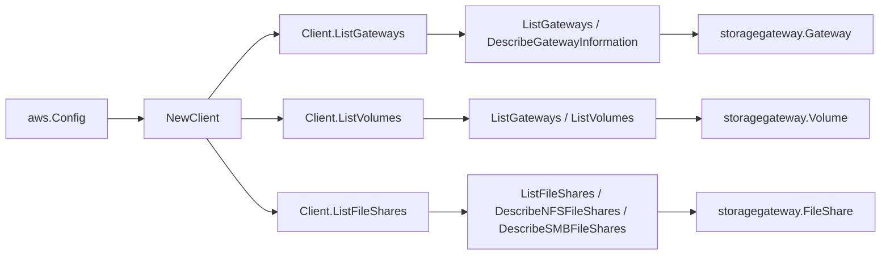

# AWS Storage Gateway SDK Adapter

## Purpose

`internal/collector/awscloud/services/storagegateway/awssdk` adapts AWS SDK for
Go v2 Storage Gateway responses to the scanner-owned `Client` contract. It owns
gateway pagination and per-gateway DescribeGatewayInformation enrichment, volume
pagination, file-share listing with batched NFS/SMB describe reads, throttle
classification, and per-call AWS API telemetry.

## Ownership boundary

This package owns SDK calls for Storage Gateway. It does not own workflow
claims, credential acquisition, Storage Gateway fact selection, graph writes,
reducer admission, or query behavior.

## Exported surface

See `doc.go` for the godoc contract.

- `Client` - AWS SDK-backed implementation of `storagegateway.Client`.
- `NewClient` - builds a `Client` for one claimed AWS boundary.

## Dependencies

- `internal/collector/awscloud` for account, region, and service boundary
  labels.
- `internal/collector/awscloud/services/storagegateway` for scanner-owned
  result types.
- `internal/telemetry` for AWS API call and throttle instruments.
- AWS SDK for Go v2 `storagegateway` and Smithy error contracts.

## Telemetry

Storage Gateway paginator pages and point reads are wrapped with:

- `aws.service.pagination.page`
- `eshu_dp_aws_api_calls_total`
- `eshu_dp_aws_throttle_total`

Metric labels stay bounded to service, account, region, operation, and result.
Storage Gateway ARNs, names, tags, and raw AWS error payloads stay out of metric
labels.

## Gotchas / invariants

- The internal `apiClient` interface exposes only list and describe operations.
  A reflection test (`TestAPIClientInterfaceExcludesMutationAndCacheOperations`)
  fails on any method whose name carries a mutation, cache, tape, or credential
  fragment, so a future addition like `RefreshCache` or `CreateNFSFileShare`
  cannot slip past.
- Gateway network-interface IP addresses are reduced to a count
  (`NetworkInterfaceCount`); raw IPv4/IPv6 addresses are never propagated.
- NFS client allow lists and SMB admin/user lists are never propagated; the
  adapter forwards only safe identity, type, status, and dependency ARNs.
- File-share ARNs are grouped by protocol and resolved through the matching
  Describe*FileShares API in bounded batches.
- The adapter must not call `ActivateGateway`, `DeleteGateway`,
  `ShutdownGateway`, `StartGateway`, `UpdateGatewayInformation`, `RefreshCache`,
  `CreateNFSFileShare`, `CreateSMBFileShare`, `DeleteFileShare`,
  `CreateCachediSCSIVolume`, `CreateStorediSCSIVolume`, `DeleteVolume`,
  `SetLocalConsolePassword`, `SetSMBGuestPassword`, or any other mutation, tape,
  or credential API.
- SDK adapters translate AWS records into scanner-owned types; scanner tests
  should not mock AWS SDK pagination.

## Related docs

- `docs/public/services/collector-aws-cloud-scanners.md`
- `docs/public/services/collector-aws-cloud-security.md`
