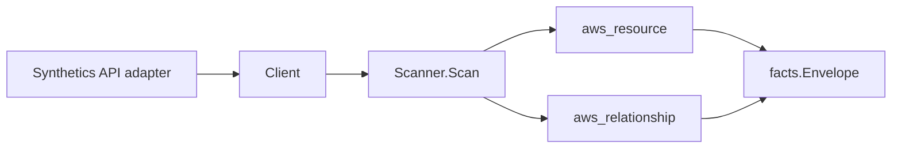

# Amazon CloudWatch Synthetics Scanner

## Purpose

`internal/collector/awscloud/services/synthetics` owns the Amazon CloudWatch
Synthetics scanner contract for the AWS cloud collector. It converts canary
control-plane metadata into `aws_resource` facts and emits relationship evidence
for the canary's S3 artifact bucket, IAM execution role, and (for VPC-configured
canaries) VPC subnets and security groups.

## Ownership boundary

This package owns scanner-level Synthetics fact selection and identity mapping.
It does not own AWS SDK pagination, STS credentials, workflow claims, fact
persistence, graph writes, reducer admission, or query behavior.

## Exported surface

See `doc.go` for the godoc contract.

- `Client` - minimal Synthetics metadata read surface consumed by `Scanner`.
- `Scanner` - emits canary resources plus their relationships for one boundary.
- `Snapshot`, `Canary` - scanner-owned views with canary script source code, run
  artifacts, and run results intentionally absent.

## Dependencies

- `internal/collector/awscloud` for boundaries, resource constants, relationship
  constants, partition helpers, and envelope builders.
- `internal/facts` for emitted fact envelope kinds.

The package depends on a small `Client` interface rather than the AWS SDK for Go
v2 so tests can use fake clients and the runtime adapter can own SDK behavior.

## Telemetry

This scanner emits no spans or logs directly. `awsruntime.ClaimedSource` records
scan duration and emitted resource counts after `Scanner.Scan` returns. The
`awssdk` adapter records Synthetics API call counts, throttles, and pagination
spans.

## Gotchas / invariants

- Synthetics facts are metadata only. The scanner must never read or persist
  canary script source code (handler, source location, zip file), run artifacts
  (logs, screenshots, HAR files), or run results, and must never create, update,
  start, stop, or delete a canary.
- `DescribeCanaries` returns no canary ARN field, so the adapter synthesizes the
  partition-aware ARN (`arn:<partition>:synthetics:<region>:<account>:canary:<name>`)
  from the scan boundary via `awscloud.PartitionForBoundary`. The canary node
  publishes that ARN as its resource_id (falling back to the canary name).
- The canary-to-S3 edge is emitted only when an artifact location is reported.
  Synthetics reports a `bucket/prefix` location PATH, not an ARN, so the scanner
  extracts the leading bucket-name segment and synthesizes the partition-aware
  bucket ARN (`arn:<partition>:s3:::<bucket>`) to match the S3 scanner's
  published bucket resource_id in GovCloud and China, not just commercial.
- The canary-to-IAM-role edge keys the target by the execution role ARN, which
  matches how the IAM scanner publishes its role resource_id.
- The canary-to-subnet and canary-to-security-group edges are emitted only when
  the canary is VPC-configured, and key the targets by the BARE `subnet-...` and
  `sg-...` ids the EC2 scanner publishes (no ARN).
- Emit reported evidence only. Do not infer deployment, workload, repository
  ownership, environment, or deployable-unit truth from canary names or AWS tags.

## Evidence

No-Regression Evidence: metadata-only control-plane scanner; new read path, no change to existing hot paths. `go test ./internal/collector/awscloud/services/synthetics/...` green.

No-Observability-Change: reuses shared AWS pagination span + API-call/throttle counters; no telemetry contract change.

Collector Performance Evidence:
`go test ./internal/collector/awscloud/services/synthetics/...` covers the
bounded Synthetics metadata path: one paginated DescribeCanaries stream, no run
reads, no code reads, no mutations, and no graph writes in the collector.

Collector Deployment Evidence: Synthetics runs inside the existing hosted
`collector-aws-cloud` runtime, so `/healthz`, `/readyz`, `/metrics`, and
`/admin/status` stay covered by the command wiring and Helm collector runtime.

## Related docs

- `docs/public/services/collector-aws-cloud.md`
- `docs/public/services/collector-aws-cloud-scanners.md`
- `docs/public/services/collector-aws-cloud-security.md`
