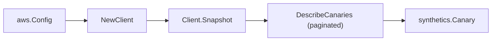

# Amazon CloudWatch Synthetics SDK Adapter

## Purpose

`internal/collector/awscloud/services/synthetics/awssdk` adapts AWS SDK for Go
v2 CloudWatch Synthetics responses to the scanner-owned `Client` contract. It
owns canary pagination, partition-aware canary ARN synthesis, throttle
classification, and per-call AWS API telemetry.

## Ownership boundary

This package owns SDK calls for Synthetics. It does not own workflow claims,
credential acquisition, Synthetics fact selection, graph writes, reducer
admission, or query behavior.

## Exported surface

See `doc.go` for the godoc contract.

- `Client` - AWS SDK-backed implementation of `synthetics.Client`.
- `NewClient` - builds a `Client` for one claimed AWS boundary.

## Dependencies

- `internal/collector/awscloud` for account, region, and service boundary
  labels, and the partition helper used to synthesize the canary ARN.
- `internal/collector/awscloud/services/synthetics` for scanner-owned result
  types.
- `internal/telemetry` for AWS API call and throttle instruments.
- AWS SDK for Go v2 `synthetics` and Smithy error contracts.

## Telemetry

Synthetics paginator pages are wrapped with:

- `aws.service.pagination.page`
- `eshu_dp_aws_api_calls_total`
- `eshu_dp_aws_throttle_total`

Metric labels stay bounded to service, account, region, operation, and result.
Synthetics ARNs, names, schedules, tags, and raw AWS error payloads stay out of
metric labels.

## Gotchas / invariants

- `DescribeCanaries` returns the canary `Tags` inline, so the adapter needs no
  separate tag read. It returns no canary `Arn` field, so the adapter
  synthesizes the partition-aware ARN
  (`arn:<partition>:synthetics:<region>:<account>:canary:<name>`) from the scan
  boundary via `awscloud.PartitionForBoundary`; never hardcode `arn:aws:`.
- The adapter reads metadata only. It must never call `GetCanaryRuns`,
  `DescribeCanariesLastRun`, `GetCanary` (which returns the canary code
  location), or any `CreateCanary`, `UpdateCanary`, `DeleteCanary`,
  `StartCanary`, `StopCanary`, `StartCanaryDryRun`, or other mutation/control
  API.
- The adapter copies only the run-artifact S3 encryption configuration
  (encryption mode, KMS key ARN) and the VPC config (vpc id, subnet ids,
  security group ids). It never reads run artifacts or run results.
- SDK adapters translate AWS responses into scanner-owned types; scanner tests
  should not mock AWS SDK pagination.

## Related docs

- `docs/public/services/collector-aws-cloud-scanners.md`
- `docs/public/services/collector-aws-cloud-security.md`
