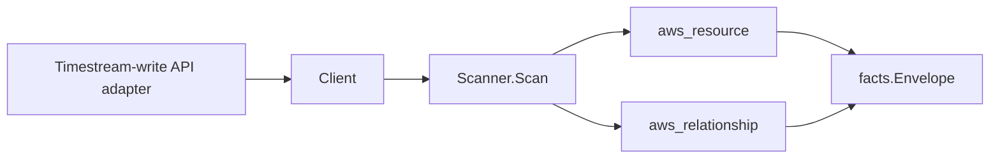

# Amazon Timestream Scanner

## Purpose

`internal/collector/awscloud/services/timestream` owns the Amazon Timestream
for LiveAnalytics scanner contract for the AWS cloud collector. It converts
Timestream database and table metadata into `aws_resource` facts and emits
relationship evidence for table-in-database membership, the database KMS
encryption key, and the table magnetic-store rejected-data report S3 bucket
location.

## Ownership boundary

This package owns scanner-level Timestream fact selection and identity mapping.
It does not own AWS SDK pagination, STS credentials, workflow claims, fact
persistence, graph writes, reducer admission, or query behavior.

## Exported surface

See `doc.go` for the godoc contract.

- `Client` - minimal Timestream metadata read surface consumed by `Scanner`.
- `Scanner` - emits database and table resources plus their relationships for
  one boundary.
- `Snapshot`, `Database`, `Table` - scanner-owned views with record, measure,
  and query-result fields intentionally absent.

## Dependencies

- `internal/collector/awscloud` for boundaries, resource constants,
  relationship constants, partition helpers, and envelope builders.
- `internal/facts` for emitted fact envelope kinds.

The package depends on a small `Client` interface rather than the AWS SDK for
Go v2 so tests can use fake clients and the runtime adapter can own SDK
behavior.

## Telemetry

This scanner emits no spans or logs directly. `awsruntime.ClaimedSource`
records scan duration and emitted resource counts after `Scanner.Scan` returns.
The `awssdk` adapter records Timestream API call counts, throttles, and
pagination spans.

## Gotchas / invariants

- Timestream facts are metadata only. The scanner must never read time-series
  records, measure values, or query results, and must never write records or
  call any mutation API.
- The database node publishes its resource_id as the database ARN (falling back
  to the database name). The table-in-database edge is keyed by that same
  database ARN so it joins the database node instead of dangling.
- A table's own edges (table-in-database, table-to-S3) are sourced on the table
  ARN, which is the resource_id the table node publishes.
- The database-to-KMS-key edge is emitted only when AWS reports a key
  identifier. AWS reports a key ARN for Timestream databases, which matches the
  KMS scanner's published key resource_id; `target_arn` is set only for
  ARN-shaped identifiers.
- The table-to-S3 edge is emitted only when a magnetic-store rejected-data
  bucket is configured. Timestream reports a bucket NAME, so the scanner
  synthesizes the partition-aware bucket ARN (`arn:<partition>:s3:::<bucket>`)
  via `awscloud.PartitionForBoundary` to match the S3 scanner's published
  bucket node identity in GovCloud and China, not just commercial.
- Emit reported evidence only. Do not infer deployment, workload, repository
  ownership, environment, or deployable-unit truth from database, table, or
  bucket names, or AWS tags.

## Evidence

Collector Performance Evidence:
`go test ./internal/collector/awscloud/services/timestream/...` covers the
bounded Timestream metadata path: one paginated ListDatabases stream, one
paginated ListTables stream per database, one ListTagsForResource point read
per database and per table, no record reads, no queries, no WriteRecords, no
mutations, and no graph writes in the collector.

No-Regression Evidence:
`go test ./cmd/collector-aws-cloud ./internal/collector/awscloud/...` covers
Timestream database and table metadata fact emission, table-in-database,
database-to-KMS-key, and table-to-S3 relationship emission with the target
type and target resource id each downstream join needs, the no-records
metadata-only assertions, the SDK adapter exclusion reflection test that fails
the build if a record-read or mutation method ever reaches the adapter,
GovCloud and China synthesized-bucket-ARN partition derivation, runtime
registration, and the SDK adapter's safe metadata mapping.

No-Observability-Change: the existing AWS collector telemetry contract already
diagnoses Timestream scans through `aws.service.scan`,
`aws.service.pagination.page`, `eshu_dp_aws_api_calls_total`,
`eshu_dp_aws_throttle_total`, `eshu_dp_aws_resources_emitted_total`,
`eshu_dp_aws_relationships_emitted_total`, and `aws_scan_status` rows. This
scanner adds no instrument, span, metric label, or status row. Metric labels
stay bounded to service, account, region, operation, result, and status.

Collector Deployment Evidence: Timestream runs inside the existing hosted
`collector-aws-cloud` runtime, so `/healthz`, `/readyz`, `/metrics`, and
`/admin/status` stay covered by the command wiring and Helm collector runtime.

## Related docs

- `docs/public/services/collector-aws-cloud.md`
- `docs/public/services/collector-aws-cloud-scanners.md`
- `docs/public/services/collector-aws-cloud-security.md`
