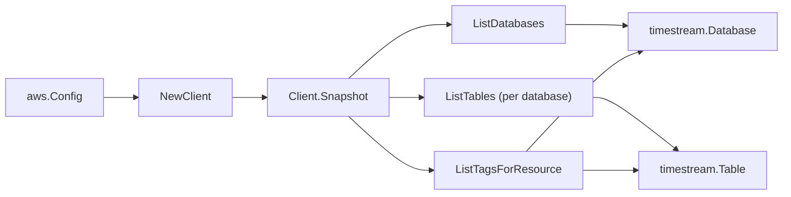

# Amazon Timestream SDK Adapter

## Purpose

`internal/collector/awscloud/services/timestream/awssdk` adapts AWS SDK for Go
v2 Timestream-write responses to the scanner-owned `Client` contract. It owns
database pagination, per-database table pagination, resource-tag reads,
throttle classification, and per-call AWS API telemetry.

## Ownership boundary

This package owns SDK calls for Timestream. It does not own workflow claims,
credential acquisition, Timestream fact selection, graph writes, reducer
admission, or query behavior.

## Exported surface

See `doc.go` for the godoc contract.

- `Client` - AWS SDK-backed implementation of `timestream.Client`.
- `NewClient` - builds a `Client` for one claimed AWS boundary.

## Dependencies

- `internal/collector/awscloud` for account, region, and service boundary
  labels.
- `internal/collector/awscloud/services/timestream` for scanner-owned result
  types.
- `internal/telemetry` for AWS API call and throttle instruments.
- AWS SDK for Go v2 `timestreamwrite` and Smithy error contracts.

## Telemetry

Timestream paginator pages and point reads are wrapped with:

- `aws.service.pagination.page`
- `eshu_dp_aws_api_calls_total`
- `eshu_dp_aws_throttle_total`

Metric labels stay bounded to service, account, region, operation, and result.
Timestream resource ARNs, names, retention, tags, and raw AWS error payloads
stay out of metric labels.

## Gotchas / invariants

- The Timestream-write management endpoint requires endpoint discovery. The SDK
  enables discovery automatically for ListDatabases and ListTables, so
  `NewFromConfig` needs no extra option; do not disable discovery.
- The adapter reads metadata only. It must never call `WriteRecords`, any
  `Query` (the timestream-query module is never imported), `CreateBatchLoadTask`
  or other batch-load APIs, `CreateDatabase`, `UpdateDatabase`,
  `DeleteDatabase`, `CreateTable`, `UpdateTable`, `DeleteTable`, or any other
  mutation API.
- The adapter copies only the magnetic-store rejected-data report S3 location
  configuration (bucket name, prefix, encryption option). It never reads the
  rejected records themselves.
- `ListTagsForResource` is a metadata read; AWS Timestream tags carry no record
  content.
- SDK adapters translate AWS records into scanner-owned types; scanner tests
  should not mock AWS SDK pagination.

## Related docs

- `docs/public/services/collector-aws-cloud-scanners.md`
- `docs/public/services/collector-aws-cloud-security.md`
