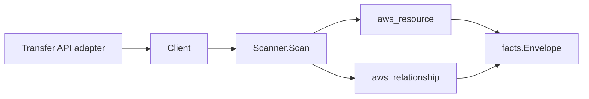

# AWS Transfer Family Scanner

## Purpose

`internal/collector/awscloud/services/transfer` owns the Transfer Family scanner
contract for the AWS cloud collector. It converts Transfer server metadata and
service-managed user metadata into `aws_resource` facts and emits relationship
evidence for server-to-VPC-endpoint, server-to-Elastic-IP, server-to-ACM-
certificate (FTPS), server-to-CloudWatch-log-group, server-to-logging-IAM-role,
user-to-IAM-role, user-home-directory-to-S3-bucket, and
user-home-directory-to-EFS-file-system dependencies.

## Ownership boundary

This package owns scanner-level Transfer fact selection and identity mapping. It
does not own AWS SDK pagination, STS credentials, workflow claims, fact
persistence, graph writes, reducer admission, or query behavior.

## Exported surface

See `doc.go` for the godoc contract.

- `Client` - minimal Transfer metadata read surface consumed by `Scanner`.
- `Scanner` - emits server and user resources plus their relationships for one
  boundary.
- `Server`, `User`, `HomeDirectoryMapping` - scanner-owned views with
  key-material and policy fields intentionally omitted.

## Dependencies

- `internal/collector/awscloud` for boundaries, resource constants,
  relationship constants, and envelope builders.
- `internal/facts` for emitted fact envelope kinds.

The package depends on a small `Client` interface rather than the AWS SDK for
Go v2 so tests can use fake clients and runtime adapters can own SDK behavior.

## Telemetry

This scanner emits no spans or logs directly. `awsruntime.ClaimedSource`
records scan duration and emitted resource counts after `Scanner.Scan` returns.
The `awssdk` adapter records Transfer API call counts, throttles, and
pagination spans.

## Gotchas / invariants

- Transfer facts are metadata only. The scanner must not create, update, delete,
  start, or stop a server or user, must never import or read host keys or SSH
  public keys, and must never persist user policy JSON, POSIX UID/GID material,
  login banners, or identity-provider invocation secrets.
- Host key fingerprints and host key material stay outside the contract. The
  scanner-owned `Server` type has no field for them, and the SDK adapter drops
  `HostKeyFingerprint` even though `DescribeServer` returns it.
- SSH public key bodies, user policy JSON, and POSIX UID/GID material stay
  outside the contract. The scanner-owned `User` type has no field for them, and
  the SDK adapter drops `SshPublicKeys`, `Policy`, and `PosixProfile` even though
  `DescribeUser` returns them.
- Home-directory mappings are recorded as paths only. The scanner records the
  virtual `entry` path and backing `target` path; object and file contents are
  never read.
- Server and user ARNs come from the API and are used directly. ACM certificate
  and IAM role targets prefer the API-provided ARNs. S3 bucket and EFS file
  system home-directory targets are reported by AWS as bare paths, so the
  scanner synthesizes the partition-aware target ARN (`arn:<partition>:s3:::`
  and `arn:<partition>:elasticfilesystem:<region>:<account>:file-system/`) via
  `partition(boundary)` so GovCloud and China joins resolve.
- VPC endpoint and Elastic IP edges are keyed by the bare ID the VPC scanner
  publishes (`vpce-...`, `eipalloc-...`); these edges carry no target ARN.
- ARN-keyed edges (ACM, IAM role, CloudWatch log group, S3 bucket, EFS file
  system) are emitted only when AWS reports an ARN-shaped (or synthesizable)
  join key. Non-ARN role/certificate identities are dropped.
- The EFS home-directory edge requires the boundary account and region to
  reconstruct the EFS scanner's ARN; it is skipped when either is unknown.
- Emit reported evidence only. Do not infer deployment, workload, repository
  ownership, environment, or deployable-unit truth from server, user, or path
  names, or AWS tags.

## Evidence

Collector Performance Evidence:
`go test ./internal/collector/awscloud/services/transfer/...` covers the bounded
Transfer metadata path: one paginated ListServers stream, one DescribeServer
point read per server, one paginated ListUsers stream per server, one
DescribeUser point read per user, no CreateServer / DeleteServer / StartServer /
StopServer / ImportSshPublicKey / ImportHostKey calls, no mutations, and no
graph writes in the collector.

No-Regression Evidence:
`go test ./cmd/collector-aws-cloud ./internal/collector/awscloud/...` covers
Transfer server and user metadata fact emission, server-to-VPC-endpoint,
server-to-Elastic-IP, server-to-ACM-certificate, server-to-CloudWatch-log-group,
server-to-logging-IAM-role, user-to-IAM-role, user-home-directory-to-S3-bucket,
and user-home-directory-to-EFS-file-system relationship emission, the
partition-aware S3/EFS home-directory ARN derivation
(commercial / `aws-us-gov` / `aws-cn`), host-key / SSH-key / policy / POSIX
exclusion, the reflective SDK adapter exclusion guard, runtime registration,
command configuration, and the SDK adapter's safe metadata mapping. The scanner
adds new metadata-only read paths and synthesizes only partition-aware target
ARNs; it performs no graph writes, queue work, leases, or hot-path Cypher, so
there is no runtime performance regression for the touched path.

Collector Observability Evidence: Transfer uses the existing AWS collector
`aws.service.pagination.page` span plus `eshu_dp_aws_api_calls_total`,
`eshu_dp_aws_throttle_total`, `eshu_dp_aws_resources_emitted_total`,
`eshu_dp_aws_relationships_emitted_total`, and `aws_scan_status` rows. Metric
labels stay bounded to service, account, region, operation, result, and status.

No-Observability-Change: the scanner introduces no new instrument, span, metric
label, or `aws_scan_status` row; it reuses the existing AWS collector telemetry
contract (`aws.service.scan`, `aws.service.pagination.page`, API/throttle
counters, resource/relationship counters, and `aws_scan_status`) that already
diagnoses every per-service scan.

Collector Deployment Evidence: Transfer runs inside the existing hosted
`collector-aws-cloud` runtime, so `/healthz`, `/readyz`, `/metrics`, and
`/admin/status` stay covered by the command wiring and Helm collector runtime.

## Related docs

- `docs/public/services/collector-aws-cloud.md`
- `docs/public/services/collector-aws-cloud-scanners.md`
- `docs/public/services/collector-aws-cloud-security.md`
