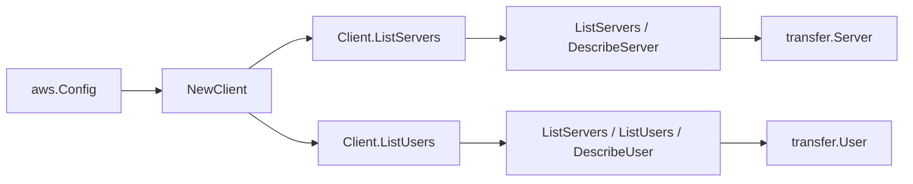

# AWS Transfer Family SDK Adapter

## Purpose

`internal/collector/awscloud/services/transfer/awssdk` adapts AWS SDK for Go v2
Transfer Family responses to the scanner-owned `Client` contract. It owns
server pagination and point reads, user pagination and point reads per server,
throttle classification, and per-call AWS API telemetry.

## Ownership boundary

This package owns SDK calls for Transfer Family. It does not own workflow
claims, credential acquisition, Transfer fact selection, graph writes, reducer
admission, or query behavior.

## Exported surface

See `doc.go` for the godoc contract.

- `Client` - AWS SDK-backed implementation of `transfer.Client`.
- `NewClient` - builds a `Client` for one claimed AWS boundary.

## Dependencies

- `internal/collector/awscloud` for account, region, and service boundary
  labels.
- `internal/collector/awscloud/services/transfer` for scanner-owned result
  types.
- `internal/telemetry` for AWS API call and throttle instruments.
- AWS SDK for Go v2 `transfer` and Smithy error contracts.

## Telemetry

Transfer paginator pages and point reads are wrapped with:

- `aws.service.pagination.page`
- `eshu_dp_aws_api_calls_total`
- `eshu_dp_aws_throttle_total`

Metric labels stay bounded to service, account, region, operation, and result.
Transfer resource ARNs, names, paths, tags, and raw AWS error payloads stay out
of metric labels.

## Gotchas / invariants

- The adapter calls only `ListServers`, `DescribeServer`, `ListUsers`, and
  `DescribeUser`. A reflective exclusion test (`exclusion_test.go`) fails the
  build if any mutation, lifecycle, or key-material method becomes reachable on
  the adapter-local `apiClient` interface.
- `DescribeServer` returns `HostKeyFingerprint` and login banners; the adapter
  drops them. The scanner-owned `Server` type has no field for host key
  material.
- `DescribeUser` returns `SshPublicKeys` (key bodies), `Policy` (scope-down
  policy JSON), and `PosixProfile` (UID/GID); the adapter drops all three. The
  scanner-owned `User` type has no field for them.
- Home-directory mappings forward only the virtual `Entry` path and backing
  `Target` path. No object or file contents are read.
- SDK adapters translate AWS records into scanner-owned types; scanner tests
  should not mock AWS SDK pagination.

## Related docs

- `docs/public/services/collector-aws-cloud-scanners.md`
- `docs/public/services/collector-aws-cloud-security.md`
